# E0509 Direct 환경 학습 로그

## 환경 개요

| 항목 | 값 |
|------|-----|
| 환경 타입 | Direct (DirectRLEnv) |
| 로봇 | Doosan E0509 + RH-P12-RN-A 그리퍼 |
| 작업 | 펜 캡 접근 + Z축 정렬 |
| 학습 방식 | PPO (RSL-RL) |

## 상태 머신 버전 이력

### V3 (2024-12-18) - 현재 (Pre-grasp 방식)
```
PRE_GRASP (펜캡 위 7cm + 정렬)
    ↓ 거리 < 3cm & dot < -0.95
DESCEND (정렬 유지하며 수직 하강)
    ↓ 거리 < 2cm & dot < -0.95
SUCCESS!
```

**핵심 변경**:
- Pre-grasp 위치에서 충분히 정렬 후 수직 하강
- 지수적 정렬 보상 (dot < -0.9부터 급격히 증가)
- 특이점 회피 페널티 (joint 3, 5)
- 더 엄격한 정렬 조건 (dot < -0.95 = 약 18도 이내)

### V2 (2024-12-17) - Deprecated
```
ALIGN (정렬) ← 먼저 정렬!
    ↓ dot < -0.8
APPROACH (접근) + 정렬 유지
    ↓ 거리 < 10cm
GRASP (잡기)
    ↓ 거리 < 2cm & dot < -0.9
SUCCESS!
```

### V1 (기존) - Deprecated
```
APPROACH (접근)
    ↓ 거리 < 10cm
ALIGN (정렬)
    ↓ dot < -0.8
GRASP (잡기)
    ↓ 거리 < 2cm & dot < -0.9
SUCCESS!
```

## 관찰 공간 (27차원)

| 관찰 | 차원 | 설명 |
|------|------|------|
| joint_pos | 6 | 관절 위치 |
| joint_vel | 6 | 관절 속도 |
| grasp_pos | 3 | 그리퍼 잡기 포인트 (로컬) |
| cap_pos | 3 | 펜 캡 위치 (로컬) |
| rel_pos | 3 | 상대 위치 (cap - grasp) |
| gripper_z | 3 | 그리퍼 Z축 방향 |
| pen_z | 3 | 펜 Z축 방향 |

## 액션 공간 (6차원)

- 6 DOF 팔 관절 delta position control
- action_scale: 0.1
- 그리퍼: 열린 상태 고정

## 보상 구조

### V3 (현재) - PRE_GRASP → DESCEND + 지수적 정렬 보상

#### 지수적 정렬 보너스
```python
# dot < -0.9부터 증가 (밸런스 조정됨)
exponential_bonus = exp((−dot − 0.9) × 10)
```

| dot 값 | 오차 각도 | 지수 보너스 |
|--------|-----------|-------------|
| -0.9   | ~25°      | 1.0 (기준)  |
| -0.95  | ~18°      | 1.6         |
| -0.99  | ~8°       | 2.5         |
| -1.0   | 0°        | 2.7         |

#### PRE_GRASP 단계
| 보상 | 스케일 | 설명 |
|------|--------|------|
| pre-grasp 거리 페널티 | -8.0 | 펜캡 위 7cm 위치까지 거리 |
| 진행 보상 | +20.0 | 거리 감소량 |
| 기본 정렬 보상 | +1.5 | (-dot - 0.5) / 0.5 |
| 지수적 정렬 보너스 | +0.3 | exponential_bonus |
| 단계 전환 보너스 | +15.0 | DESCEND 진입 시 |

#### DESCEND 단계
| 보상 | 스케일 | 설명 |
|------|--------|------|
| 펜캡 거리 페널티 | -10.0 | 펜캡까지 거리 |
| 기본 정렬 유지 보상 | +2.0 | -dot |
| 지수적 정렬 보너스 | +0.3 | exponential_bonus |
| 하강 진행 보상 | +15.0 | 거리 감소량 |
| 정렬 풀림 페널티 | -5.0 | dot > -0.9일 때 |
| 성공 보너스 | +100.0 | 성공 시 |

#### 특이점 회피 페널티
| 관절 | 조건 | 페널티 |
|------|------|--------|
| Joint 3 (팔꿈치) | \|pos\| < 0.15 rad | -1.0 |
| Joint 5 (손목) | \|pos\| < 0.15 rad | -1.0 |

#### 공통
| 보상 | 스케일 | 설명 |
|------|--------|------|
| 액션 페널티 | -0.01 | action^2 * scale |
| 반대 방향 페널티 | -2.0 | dot > 0일 때 |

> **밸런스 조정 (2024-12-18)**: 정렬 보상이 거리/진행 보상보다 30~144배 컸던 문제 수정. 거리/진행 보상 강화, 지수적 정렬 보상 축소하여 약 1:1 비율로 조정.

---

### V2 (Deprecated) 보상 구조

<details>
<summary>V2 보상 구조 (클릭해서 펼치기)</summary>

#### ALIGN 단계 (1단계)
| 보상 | 스케일 | 설명 |
|------|--------|------|
| 정렬 보상 | +2.0 | (-dot - 0.5) / 0.5 * scale |
| 약한 거리 페널티 | -1.0 | distance * scale |
| 단계 전환 보너스 | +10.0 | APPROACH 진입 시 |

#### APPROACH 단계 (2단계)
| 보상 | 스케일 | 설명 |
|------|--------|------|
| 거리 페널티 | -2.0 | distance * scale |
| 진행 보상 | +5.0 | (prev_dist - dist) * scale |
| 정렬 유지 보상 | +1.0 | (-dot - 0.7) * scale |
| 단계 전환 보너스 | +10.0 | GRASP 진입 시 |

#### GRASP 단계 (3단계)
| 보상 | 스케일 | 설명 |
|------|--------|------|
| 거리 페널티 | -3.0 | distance * scale |
| 정렬 유지 보상 | +1.0 | -dot * scale |
| 성공 보너스 | +100.0 | 성공 시 |

</details>

## 환경 설정

### 펜 위치 랜덤화
```python
pen_pos_range = {
    "x": (0.3, 0.5),
    "y": (-0.15, 0.15),
    "z": (0.25, 0.35),
}
```

### 펜 방향 (1단계: 수직 고정)
```python
pen_rot_range = {
    "roll": (0.0, 0.0),
    "pitch": (0.0, 0.0),
    "yaw": (0.0, 0.0),
}
```

### 2단계 (나중에 활성화)
```python
pen_rot_range = {
    "roll": (-0.5, 0.5),    # ±30도
    "pitch": (-0.5, 0.5),   # ±30도
    "yaw": (-3.14, 3.14),   # 전체 회전
}
collect_data = True  # Feasibility 데이터 수집
```

## 학습 하이퍼파라미터

```python
train_cfg = {
    "num_steps_per_env": 24,
    "max_iterations": 5000,
    "save_interval": 100,
    "policy": {
        "init_noise_std": 0.3,
        "actor_hidden_dims": [256, 256, 128],
        "critic_hidden_dims": [256, 256, 128],
        "activation": "elu",
    },
    "algorithm": {
        "learning_rate": 3e-4,
        "gamma": 0.99,
        "lam": 0.95,
        "entropy_coef": 0.01,
        "clip_param": 0.2,
        "desired_kl": 0.01,
        "num_learning_epochs": 5,
        "num_mini_batches": 4,
    },
}
```

## 학습 실행

```bash
source ~/isaacsim_env/bin/activate
cd ~/IsaacLab
python pen_grasp_rl/scripts/train_direct.py --headless --num_envs 4096 --max_iterations 5000
```

## 테스트 실행

```bash
python pen_grasp_rl/scripts/play_direct.py --checkpoint /path/to/model.pt --num_envs 50
```

---

## 학습 기록

---

### 실험 1: V1 (APPROACH → ALIGN → GRASP)

**날짜**: 2024-12-17

**설정**:
- 펜 위치: 랜덤
- 펜 방향: 수직 고정
- num_envs: 4096
- max_iterations: 5000
- 로그 위치: `/home/fhekwn549/e0509_direct`

**결과**:
| Iteration | Mean Reward | Episode Length | Noise Std | 비고 |
|-----------|-------------|----------------|-----------|------|
| 0 | -38.6 | 359 | 0.30 | 초기값 |
| 1100 | 304.4 | 359 | 0.68 | 최종 |

**단계별 분포 (마지막)**:
| 단계 | 비율 | 설명 |
|------|------|------|
| APPROACH | 0% | 모두 통과 |
| ALIGN | ~100% | 여기서 막힘 |
| GRASP | 0% | 진입 실패 |

**문제점 분석**:
1. **Episode Length = 359 (max)**: 성공 종료 없음
2. **Noise Std 증가 (0.30 → 0.68)**: 불안정한 학습
3. **ALIGN 단계 정체**: 가까운 거리에서 정렬 어려움
4. **성공 조건 미달**: 거리 < 2cm & dot < -0.9 달성 못함

**원인**:
- 먼저 접근 후 정렬하면, 이미 가까운 거리에서 정렬해야 함
- 가까운 거리에서는 작은 움직임도 거리에 큰 영향
- 정렬하면서 거리가 멀어지는 악순환

**결론**: 단계 순서 변경 필요 (ALIGN 먼저)

---

### 실험 2: V2 (ALIGN → APPROACH → GRASP)

**날짜**: 2024-12-17 ~ 2024-12-18

**변경 사항**:
1. 단계 순서: ALIGN → APPROACH → GRASP
2. APPROACH 단계에 정렬 유지 보상 추가
3. 먼저 정렬 → 정렬 유지하며 접근

**설정**:
- 펜 위치: 랜덤
- 펜 방향: 수직 고정
- num_envs: 4096
- max_iterations: 33000

**결과**:
| Iteration | Mean Reward | Episode Length | Noise Std | 비고 |
|-----------|-------------|----------------|-----------|------|
| 0 | -58.8 | 70 | - | 초기 |
| 5827 | **318.0** | 359 | - | 최고 리워드 (타임아웃) |
| 33000 | 129.0 | 24.1 | - | 수렴 (빠른 성공) |

**학습 그래프**:

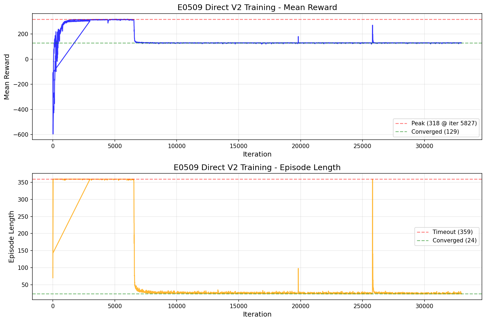

**핵심 분석**:

| 지표 | 최고점 (step 5827) | 수렴점 (step 33000) |
|------|-------------------|---------------------|
| 총 리워드 | 318 | 129 |
| 에피소드 길이 | 359 (타임아웃) | 24 |
| **스텝당 리워드** | **0.88** | **5.35** |

> **해석**: 리워드 감소는 "성능 하락"이 아님!
> - 최고점: 타임아웃까지 헤매면서 리워드 누적
> - 수렴점: 24스텝 만에 빠르게 성공 → 효율성 6배 증가

**문제점 발견**:
- Z축 정렬이 완벽하지 않음 (대략적으로만 맞춤)
- 정렬 조건이 느슨함 (dot < -0.8 = 36도 허용)
- 접근 보상(5.0)이 정렬 유지 보상(1.0)보다 5배 커서 정렬보다 접근 우선

**결론**: Pre-grasp 방식 + 지수적 정렬 보상 필요 → V3로 개선

---

### 실험 3: V3 (PRE_GRASP → DESCEND + 지수적 정렬 보상)

**날짜**: 2024-12-18

**핵심 변경 사항**:
1. **Pre-grasp 전략**: 펜캡 위 7cm에서 충분히 정렬 후 수직 하강
2. **지수적 정렬 보상**: dot < -0.9부터 보상 급격히 증가
3. **특이점 회피**: Joint 3, 5가 0 근처일 때 페널티
4. **엄격한 조건**: dot < -0.95 (18도 이내)

**설정**:
- 펜 위치: 랜덤
- 펜 방향: 수직 고정
- num_envs: 4096
- max_iterations: 10000 (예정)

**결과**:
| Iteration | Mean Reward | Episode Length | 비고 |
|-----------|-------------|----------------|------|
| 0 | ~0 | 359 | 초기 |
| 9650 | **771.77** | 359 | 최고 리워드 |
| 9999 | 753.44 | 359 | 최종 |

**학습 그래프**:

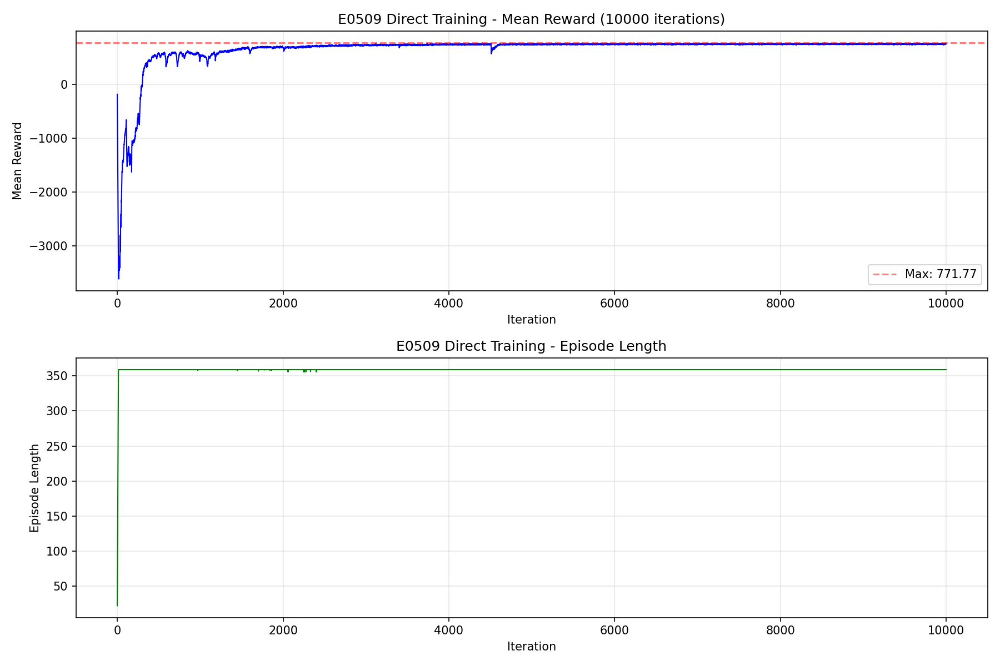

**문제점 발견** (시뮬레이션 테스트 결과):
1. **로봇 링크 겹침**: self-collision 발생
2. **과격한 움직임**: action_scale 0.1이 너무 큼
3. **특이점 페널티 부작용**: 오히려 이상한 자세 유도
4. **Episode Length = 359**: 여전히 타임아웃 (성공 종료 없음)

**해결책 → V4로 개선**

---

### 실험 4: V4 (작업 공간 기반 관절 한계 + 액션 스케일 축소)

**날짜**: 2024-12-18

**핵심 변경 사항**:

1. **펜 소환 위치 확대**:
   ```python
   pen_pos_range = {
       "x": (0.3, 0.5),      # 유지
       "y": (-0.20, 0.20),   # -0.15~0.15 → -0.20~0.20
       "z": (0.20, 0.50),    # 0.25~0.35 → 0.20~0.50
   }
   ```

2. **작업 공간 기반 관절 한계** (IK 샘플링으로 계산):
   ```python
   WORKSPACE_JOINT_LIMITS_RAD = [
       (-0.96, 0.96),    # joint_1: ±55° (base rotation)
       (-1.31, 0.61),    # joint_2: -75° ~ 35° (shoulder)
       (0.87, 2.88),     # joint_3: 50° ~ 165° (elbow - 특이점 0° 회피)
       (-0.79, 0.79),    # joint_4: ±45° (wrist 1)
       (1.05, 2.09),     # joint_5: 60° ~ 120° (wrist 2 - 특이점 0° 회피)
       (-0.79, 0.79),    # joint_6: ±45° (wrist 3)
   ]
   ```

3. **액션 스케일 축소**: 0.1 → 0.05 (과격한 움직임 방지)

4. **특이점 페널티 비활성화**: -1.0 → 0.0 (관절 한계로 대체)

**관절 한계 계산 방법**:
- 작업 공간(펜 위치 범위 + pre-grasp 7cm)에서 5000개 포인트 IK 샘플링
- 유효한 IK 솔루션들의 관절 범위 + 15° 마진
- Joint 3, 5가 자연스럽게 특이점(0°) 회피

**설정**:
- 펜 위치: 확대된 범위
- 펜 방향: 수직 고정
- num_envs: 4096
- max_iterations: TBD

**결과**:
| Iteration | Mean Reward | Episode Length | 비고 |
|-----------|-------------|----------------|------|
| 0 | -51.26 | 22 | 초기 |
| 3221 | **269.67** | 359 | 최고 리워드 |
| 3410 | 264.64 | 359 | 최종 (정체) |

**문제점 발견** (시뮬레이션 테스트):
- 관절 한계가 너무 제한적 (특히 joint_5: 60~120도)
- 그리퍼가 위만 바라보고 아래를 향하지 못함
- 펜에 접근 불가

---

### 실험 5: V5 (관절 한계 확장)

**날짜**: 2024-12-18

**핵심 변경 사항**:

관절 한계 확장 (그리퍼가 아래를 향할 수 있도록):

| 관절 | V4 | V5 |
|------|-----|-----|
| joint_1 | ±55° | **±90°** |
| joint_2 | -75°~35° | **-90°~45°** |
| joint_3 | 50°~165° | **30°~150°** |
| joint_4 | ±45° | **±90°** |
| joint_5 | 60°~120° | **30°~150°** |
| joint_6 | ±45° | **±90°** |

**결과**:
| Iteration | Mean Reward | Episode Length | 비고 |
|-----------|-------------|----------------|------|
| 0 | -1366.51 | ~20 | 초기 |
| 2881 | **776.66** | 359 | 최고 리워드 |
| 4058 | 751.84 | 359 | 최종 (정체) |

**학습 그래프**:

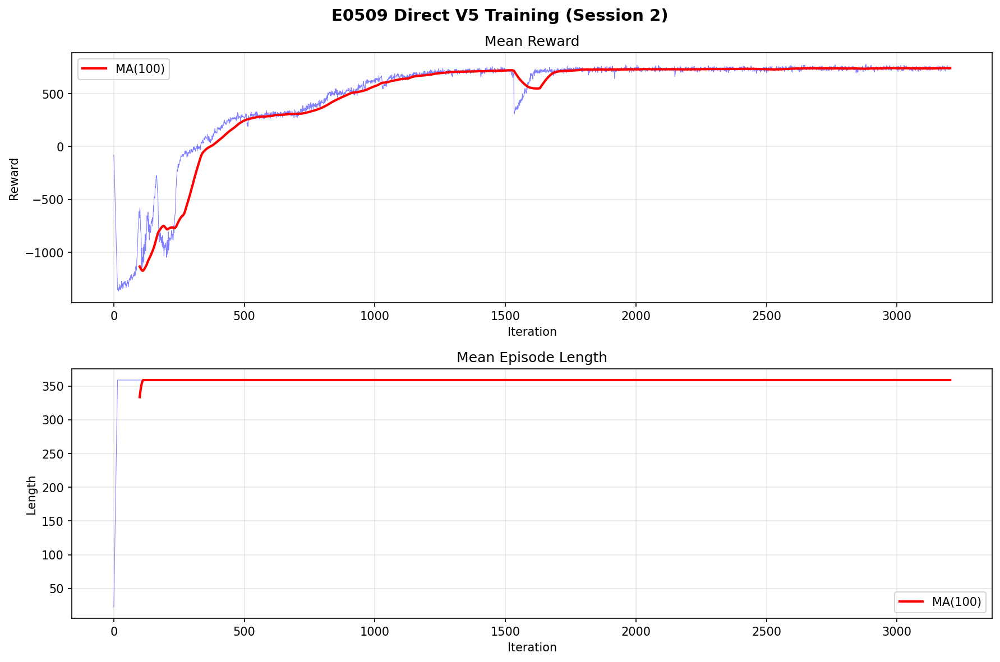

**문제점 발견** (시뮬레이션 테스트):
- **그리퍼가 아래에서 위로 올려다보는 자세**로 학습됨
- 관절 한계를 확장해도 "위에서 아래로 내려다보기" 자세 유도 어려움
- Joint space 제어의 한계: 원하는 자세를 직접 지정할 수 없음
- **Episode Length = 359**: 여전히 타임아웃 (성공 종료 없음)

**결론**: Joint space 제어의 한계 → **IK (Task Space) 제어**로 전환 필요

---

## IK 환경 (Task Space Control)

### 개요

Joint space 제어의 한계를 극복하기 위해 **IK (Inverse Kinematics) 기반 Task Space 제어** 환경 추가.

| 항목 | Direct 환경 (기존) | IK 환경 (신규) |
|------|-------------------|----------------|
| 제어 방식 | Joint space (관절 각도) | Task space (EE 위치/자세) |
| 액션 공간 | 6D (Δjoint1~6) | 6D (Δx, Δy, Δz, Δroll, Δpitch, Δyaw) |
| 관절 한계 | 작업 공간 기반 커스텀 | 로봇 기본 (soft limits) |
| 초기 자세 | 기본 | **위에서 내려다보기** (joint_5=90°) |
| 특이점 회피 | 관절 한계로 강제 | IK solver 자연 회피 |

### IK 환경 특징

**1. Task Space 액션**:
```python
action_space = 6  # [Δx, Δy, Δz, Δroll, Δpitch, Δyaw]
action_scale = 0.02  # 미터/라디안 단위
```

**2. 초기 자세 (위에서 내려다보기)**:
```python
init_state = {
    "joint_1": 0.0,
    "joint_2": -0.5,      # 어깨 약간 앞으로
    "joint_3": 1.0,       # 팔꿈치 굽힘
    "joint_4": 0.0,
    "joint_5": 1.57,      # 손목 90도 - 그리퍼가 아래를 향함
    "joint_6": 0.0,
}
```

**3. DifferentialIKController 설정**:
```python
ik_controller = DifferentialIKController(
    cfg=DifferentialIKControllerCfg(
        command_type="pose",      # 위치 + 자세 제어
        use_relative_mode=True,   # Delta 제어
        ik_method="dls",          # Damped Least Squares
        ik_params={"lambda_val": 0.05},
    ),
    num_envs=num_envs,
    device=device,
)
```

**4. 관찰 공간 확장**:
| 관찰 | 차원 | 설명 |
|------|------|------|
| (기존 Direct와 동일) | 27 | joint, grasp, cap, rel, axes |
| ee_pos | 3 | End-effector 위치 (root frame) |
| ee_axis_angle | 3 | End-effector 자세 (axis-angle) |
| **총합** | **33** | |

**5. 보상 함수**: Direct 환경과 **동일** (특이점 페널티만 제거)

### IK 환경 장점

1. **직관적인 액션 공간**: "앞으로 이동", "아래로 내려가기" 등 직접 지정
2. **초기 자세 강제**: 학습 시작부터 원하는 자세로 시작
3. **관절 한계 문제 해소**: IK가 실행 가능한 자세 계산
4. **Sim2Real 용이**: 실제 로봇에서도 Task space 제어 가능

### 실행 방법

**학습**:
```bash
source ~/isaacsim_env/bin/activate
cd ~/IsaacLab
python pen_grasp_rl/scripts/train_ik.py --headless --num_envs 4096 --max_iterations 5000
```

**테스트**:
```bash
python pen_grasp_rl/scripts/play_ik.py --checkpoint /path/to/model.pt --num_envs 50
```

### 파일 구조

```
pen_grasp_rl/
├── envs/
│   ├── e0509_direct_env.py   # 기존 Joint space 환경
│   └── e0509_ik_env.py       # Task space 환경 (V2)
└── scripts/
    ├── train_direct.py
    ├── play_direct.py
    ├── train_ik.py
    └── play_ik.py
```

---

### IK V1 실험 결과

**날짜**: 2024-12-18

**설정**:
- 펜 위치: 랜덤 (중심 기준)
- 펜 방향: 수직 고정
- num_envs: 4096
- max_iterations: 1717 (중단)

**결과**:
| Iteration | Mean Reward | Episode Length | 비고 |
|-----------|-------------|----------------|------|
| 0 | -1162.72 | ~22 | 초기 |
| 1658 | **765.97** | 359 | 최고 리워드 |
| 1716 | 731.75 | 359 | 최종 (정체) |

**학습 그래프**:

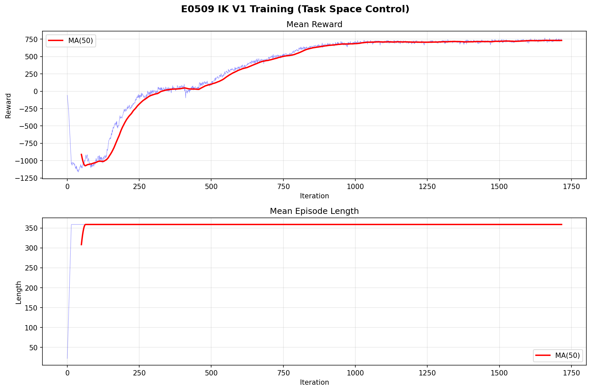

**Play 테스트 결과**:
```
최종 단계 분포: PRE_GRASP=50, DESCEND=0
총 성공 횟수: 0
```

**문제점 분석**:
1. **DESCEND 진입 실패**: 모든 환경이 PRE_GRASP에 머무름
2. **정렬 조건 충족 실패**: PRE_GRASP → DESCEND 전환에 dot < -0.95 필요
3. **위치는 접근하지만 정렬이 안 됨**: 시각적으로 펜 근처까지 가지만 자세 정렬 못함
4. **펜 생성 높이 문제**: 캡이 너무 높으면 위에서 접근 어려움

**결론**: ALIGN 단계 추가 + 펜 캡 위치 기준 생성 필요 → IK V2

---

### IK V2 (ALIGN 단계 추가 + 펜 캡 기준 생성)

**날짜**: 2024-12-18

**핵심 변경 사항**:

**1. 3단계 상태 머신**:
```
PRE_GRASP (펜캡 위 7cm로 이동)
    ↓ 거리 < 3cm (정렬 조건 없음!)
ALIGN (위치 유지 + 자세 정렬에 집중)
    ↓ dot < -0.95
DESCEND (수직 하강)
    ↓ 거리 < 2cm & dot < -0.95
SUCCESS!
```

**2. 펜 캡 위치 기준 생성**:
```python
# 기존: 펜 중심 기준 (캡이 +6cm 위로)
pen_pos_range = {"z": (0.20, 0.50)}  # → 캡 z = 0.26 ~ 0.56

# V2: 캡 위치 기준 (접근하기 쉬운 높이로 제한)
pen_cap_pos_range = {
    "x": (0.3, 0.5),
    "y": (-0.15, 0.15),
    "z": (0.25, 0.40),  # 캡이 이 높이에 오도록
}
```

**3. ALIGN 단계 보상 구조**:
| 보상 | 스케일 | 설명 |
|------|--------|------|
| 위치 유지 페널티 | -5.0 | 목표 위치에서 벗어나면 페널티 |
| 자세 정렬 보상 | +5.0 | dot 개선에 집중 |
| 지수적 정렬 보너스 | +1.0 | dot < -0.85부터 급격히 증가 |
| 단계 전환 보상 | +20.0 | DESCEND 진입 시 |

**4. PRE_GRASP → ALIGN 전환 조건 변경**:
- **기존**: 거리 < 3cm **AND** dot < -0.95
- **V2**: 거리 < 3cm **만** (정렬 조건 없음!)

**학습 결과**:
| Iteration | Mean Reward | Episode Length | 비고 |
|-----------|-------------|----------------|------|
| 0 | -73.26 | 22 | 초기 |
| 818 | **2229.27** | 359 | 최고 리워드 |
| 1999 | 1105.97 | 359 | 최종 |

**학습 그래프**:

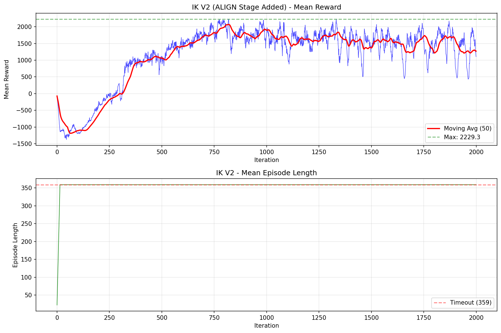

**Play 테스트 결과**:
```
최종 단계 분포: PRE_GRASP=16, ALIGN=0, DESCEND=0
총 성공 횟수: 0
```

**Play 테스트 스크린샷**:

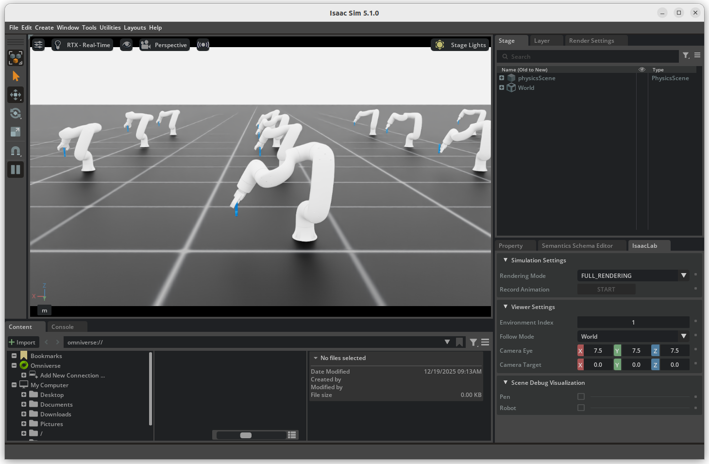

*그리퍼가 펜캡 "위"가 아닌 "옆"에서 접근하여 펜에 얹혀있는 모습*

**디버깅 분석**:
```
Step 900: reward=-0.2855, phases=[PRE:16, ALN:0, DESC:0], success=0
  → dist_pregrasp=0.0796m (need <0.03), dist_cap=0.0198m, dot=-0.8630 (need <-0.95)
```

| 지표 | 값 | 조건 | 상태 |
|------|-----|------|------|
| dist_pregrasp | 7.96cm | < 3cm 필요 | ❌ 미충족 |
| dist_cap | 1.98cm | - | ✓ 펜캡에 가까움 |
| dot | -0.863 | < -0.95 필요 | ❌ 미충족 |

**문제점 발견**:

1. **그리퍼가 펜캡 "위 7cm"가 아닌 "옆"으로 접근**:
   - 펜캡까지 거리: 2cm (매우 가까움)
   - pre-grasp 위치(펜캡 위 7cm)까지 거리: 8cm (멀다)
   - 즉, 그리퍼가 펜캡 위가 아니라 펜캡 옆으로 다가감

2. **Reward가 높았던 이유**:
   - ALIGN 단계 추가로 보상 구조 변경
   - ALIGN 진입 시 매 스텝 ~8-13점 보상 누적
   - 하지만 실제로는 ALIGN 단계에 진입조차 못함

3. **원인 추정**:
   - PRE_GRASP 보상에서 `pregrasp_dist` 페널티가 약함
   - 다른 요소(정렬 등)가 더 크게 작용하여 "위"가 아닌 "옆"으로 학습됨

**다음 해결 방안 (검토 필요)**:

1. PRE_GRASP 거리 페널티 강화
2. PRE_GRASP → ALIGN 조건을 `dist_cap` 기준으로 변경 검토
3. 관찰값 점검 (pre-grasp 위치 계산 확인)
4. TensorBoard extras 로깅 추가하여 학습 중 거리/정렬 모니터링

---

### IK V3 (펜 축 기준 접근 + 충돌 페널티 + 단계 체류 페널티)

**날짜**: 2024-12-19

**V2 문제 분석**:
- 그리퍼가 펜캡 "위"가 아닌 "옆"에서 접근
- 충돌 페널티 없어서 펜에 부딪혀도 그대로 진행
- 높이 조건("위에서")은 펜이 기울어지면 일반화 불가

**핵심 변경 사항**:

**1. 펜 축 기준 접근 (일반화 가능)**:
```python
# 그리퍼 → 캡 벡터
grasp_to_cap = cap_pos - grasp_pos

# 펜 축에 투영 (축 방향 거리)
axis_distance = dot(grasp_to_cap, pen_axis)

# 펜 축에 수직인 거리 (축에서 벗어난 정도)
projection = axis_distance * pen_axis
perpendicular_dist = norm(grasp_to_cap - projection)
```

**2. 4단계 상태 머신**:
```
APPROACH (펜 축 방향에서 접근)
    ↓ perp_dist < 3cm & axis_dist < 8cm
ALIGN (자세 정렬)
    ↓ dot < -0.95
DESCEND (하강)
    ↓ dist_cap < 2cm & dot < -0.95
GRASP (그리퍼 닫기)
    ↓ dist_cap < 1.5cm & dot < -0.95 & gripper_closed
SUCCESS!
```

**3. 새로운 페널티**:
| 페널티 | 스케일 | 설명 |
|--------|--------|------|
| perpendicular_dist | -15.0 | 펜 축에서 벗어난 거리 (강함!) |
| 충돌 페널티 | -20.0 | 펜 몸체 접촉 시 (DESCEND 전 단계) |
| 단계 체류 페널티 | -0.5/step | 100스텝 이후부터, 점점 증가 |
| 잘못된 방향 | -10.0 | 펜 뒤에서 접근 시 |

**4. APPROACH 단계 보상**:
| 보상 | 스케일 | 설명 |
|------|--------|------|
| axis_dist 페널티 | -5.0 | 축 방향 거리 |
| perp_dist 페널티 | -15.0 | 축에서 벗어난 거리 |
| on_axis 보너스 | +3.0 | perp_dist < 3cm일 때 |
| 접근 진행 보상 | +15.0 | axis_dist 감소량 |

**5. 관찰 공간 확장** (33 → 36):
| 관찰 | 차원 | 설명 |
|------|------|------|
| (기존) | 33 | joint, grasp, cap, rel, axes, ee_pose |
| perpendicular_dist | 1 | 펜 축에서 벗어난 거리 |
| axis_distance | 1 | 펜 축 방향 거리 |
| phase | 1 | 현재 단계 (정규화) |

**파일 구조**:
```
pen_grasp_rl/
├── envs/
│   └── e0509_ik_env_v3.py   # V3 환경
└── scripts/
    ├── train_ik_v3.py       # 학습
    └── play_ik_v3.py        # 테스트
```

**실행 방법**:

학습 (별도 터미널):
```bash
source ~/isaacsim_env/bin/activate
cd ~/IsaacLab
python pen_grasp_rl/scripts/train_ik_v3.py --headless --num_envs 4096 --max_iterations 5000
```

테스트:
```bash
python pen_grasp_rl/scripts/play_ik_v3.py --num_envs 16
```

**학습 결과**:

| Iteration | Mean Reward | Episode Length | 비고 |
|-----------|-------------|----------------|------|
| 0 | ~-35,000 | ~20 | 초기 (페널티 조정 전) |
| ~300 | ~-35,000 | ~100 | 페널티 스케일 조정 |
| 2004 | **+1,629.02** | 449 | 최고 리워드 |
| 2025 | **+1,621.81** | 449 | 최종 |

**학습 그래프**:

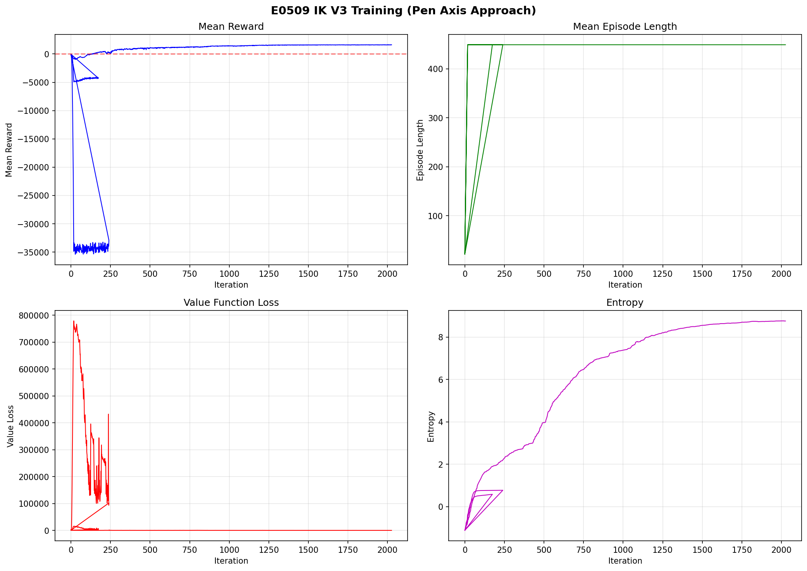

**학습 과정 분석**:

1. **초기 문제점**:
   - 보상 스케일이 너무 커서 value_function loss가 800,000+
   - phase_stall, wrong_side 페널티가 학습을 막음

2. **조정 내용**:
   - 보상 스케일 축소: perp_dist -15→-5, axis_dist -5→-2, collision -20→-5
   - phase_stall, wrong_side 페널티 비활성화 (0.0)

3. **결과**:
   - Mean Reward: -35,000 → **+1,600** (성공적인 양수 전환!)
   - Value Loss: 800,000 → **15.6** (안정화)
   - Episode Length: 449/500 (긴 에피소드)

**현재 보상 스케일** (조정 후):
```python
rew_scale_axis_dist = -2.0
rew_scale_perp_dist = -5.0
rew_scale_collision = -5.0
rew_scale_phase_stall = 0.0  # 비활성화
rew_scale_wrong_side = 0.0   # 비활성화
```

**Play 테스트 결과**:

```
Step 1700: reward=-0.2558, phases=[APP:22, ALN:7, DESC:3, GRP:0], success=0
  → perp_dist=0.0551m (need <0.03), axis_dist=0.0547m
  → dist_cap=0.0871m, dot=-0.9268 (need <-0.95)
```

**문제점 발견**:
1. **조건이 너무 엄격**: perp_dist < 3cm, dot < -0.95 충족 어려움
2. **초기 자세 문제**: 아래로 먼저 내려갔다가 다시 올라오는 패턴
3. **GRASP 진입 실패**: DESCEND까지는 도달하지만 최종 성공 0

**결론**: 조건 완화 + 초기 자세 높이기 + Hybrid 접근 필요 → **IK V4**

---

### IK V4 (Hybrid RL + TCP Control)

**날짜**: 2024-12-19

**V3 문제 분석**:
- perp_dist 조건(3cm)이 너무 엄격
- dot 조건(-0.95)도 엄격
- 정밀 정렬을 RL로 학습하기 어려움

**핵심 아이디어: Hybrid 접근**
```
[RL 정책] → 대략적 접근 (조건 완화)
              ↓
        조건 달성? (dist < 5cm, dot < -0.85)
              ↓
[TCP 제어] → 정밀 정렬 (dot → -0.98) + 수직 하강 + 그립
```

**V4 변경사항**:

| 항목 | V3 | V4 |
|------|-----|-----|
| perp_dist 조건 | < 3cm | < **5cm** |
| dot 조건 (ALIGN→FINE) | < -0.95 | < **-0.85** |
| 초기 자세 (joint_2) | -0.5 | **-0.3** (더 높게) |
| 초기 자세 (joint_3) | 1.0 | **0.8** (더 높게) |
| 펜 캡 z 범위 | 0.25~0.40 | **0.20~0.35** |
| FINE_ALIGN 단계 | 없음 | **TCP 제어 추가** |

**5단계 상태 머신**:
```
[RL] APPROACH (perp_dist<5cm, axis_dist<10cm)
        ↓
[RL] ALIGN (dot < -0.85)
        ↓
[TCP] FINE_ALIGN (dot → -0.98)  ← 정밀 정렬!
        ↓
[TCP] DESCEND (수직 하강)
        ↓
[TCP] GRASP (그리퍼 닫기)
        ↓
    SUCCESS!
```

**TCP 제어 구현**:
```python
# FINE_ALIGN: 그리퍼 z축을 펜 z축과 정렬
target_z = -pen_z
current_z = gripper_z
rotation_axis = cross(current_z, target_z)
rotation_delta = clamp(angle, max=0.02)  # rad/step

# DESCEND: 펜 축 방향으로 수직 하강
descend_dir = -pen_z
tcp_action[:3] = descend_dir * 0.003  # m/step
```

**파일 구조**:
```
pen_grasp_rl/
├── envs/
│   └── e0509_ik_env_v4.py   # Hybrid RL + TCP 환경
└── scripts/
    ├── train_ik_v4.py       # 학습
    └── play_ik_v4.py        # 테스트
```

**실행 방법**:

학습 (별도 터미널):
```bash
source ~/isaacsim_env/bin/activate
cd ~/IsaacLab
python pen_grasp_rl/scripts/train_ik_v4.py --headless --num_envs 4096 --max_iterations 5000
```

테스트:
```bash
python pen_grasp_rl/scripts/play_ik_v4.py --checkpoint /path/to/model.pt --num_envs 32
```

**학습 결과**:

| Iteration | Mean Reward | Episode Length | 비고 |
|-----------|-------------|----------------|------|
| 0 | -589.26 | ~22 | 초기 |
| ~700 | **+1,190.41** | ~400 | 최고 리워드 |
| 1470 | ~1,100 | 449 | 최종 |

**학습 그래프**:

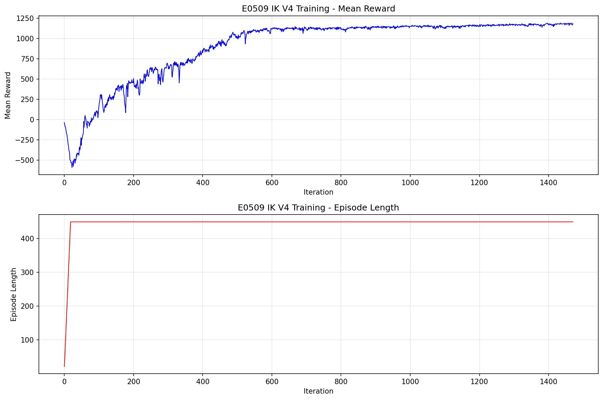

**Play 테스트 결과** (Step 700):
```
Step 700: reward=0.0028, phases=[APP:0, ALN:0, FINE:0, DESC:31, GRP:1], success=3
  → perp_dist=0.0078m (need <0.05), axis_dist=0.0075m
  → dist_cap=0.0144m, dot=-0.9756 (ALIGN needs <-0.85, FINE needs <-0.98)
  → on_correct_side=100.0%
```

**핵심 성과**:
1. **success=3 달성!**: V3에서 0이던 성공 횟수가 3으로 증가
2. **DESCEND 단계 진입**: 31개 환경이 DESCEND 진입 (TCP 제어 성공)
3. **정밀 정렬 달성**: dot=-0.9756 (약 12도 오차)
4. **Hybrid 접근 검증**: RL(APPROACH,ALIGN) + TCP(FINE_ALIGN,DESCEND,GRASP) 성공

**다음 단계**: 펜 각도 랜덤화 (±30도) 추가 후 일반화 학습

---

### IK V4 + 펜 각도 랜덤화 (roll/pitch 방식) - 발산

**날짜**: 2024-12-19

**변경사항 (초기)**:
```python
# 펜 방향 랜덤화 (roll/pitch 개별)
pen_rot_range = {
    "roll": (-0.52, 0.52),    # ±30도
    "pitch": (-0.52, 0.52),   # ±30도
    "yaw": (-3.14, 3.14),     # 전체 회전 (360°)
}
```

**문제점**: roll 30도 + pitch 30도 동시 적용 시 실제 기울기 ≈ 42도 (√(30² + 30²))

**학습 결과 (체크포인트에서 이어서 학습)**:

| 구간 | Iteration | Mean Reward | 상태 |
|------|-----------|-------------|------|
| Session 1 (원본 V4) | 0~1470 | ~1,190 | 수직 펜, 안정적 |
| Session 2 (각도 랜덤화) | 1471~3114 | ~550-600 | 적응 중, 안정적 |
| **발산** | 3115~ | -6,417 → -259,099 | **폭발** |

**발산 원인 분석**:

| 지표 | 정상 범위 | 발산 시 | 문제 |
|------|----------|---------|------|
| Noise Std | 0.2~0.5 | **10.5+** | Policy 불안정 |
| Learning Rate | 고정/안정 | 0.00001~0.003 요동 | Adaptive LR 폭주 |
| Value Loss | ~10 | **126,992,312** | Gradient Explosion |

**발산 메커니즘**:
```
기존 체크포인트 (수직 펜에 최적화)
    ↓
각도 랜덤화 추가 → Distribution Shift
    ↓
Policy 적응 어려움 → Noise Std 증가 (0.2 → 10.5)
    ↓
KL Divergence 불안정 → Adaptive LR 요동
    ↓
Step 3109에서 LR=0.003 급등 → Gradient Explosion
    ↓
발산
```

**교훈**:
1. **새로운 도메인 추가 시 체크포인트 사용 주의**: Distribution shift로 인한 발산 위험
2. **Adaptive LR의 위험성**: 불안정한 상황에서 오히려 악화시킬 수 있음
3. **각도 범위 설계**: roll/pitch 개별 방식은 실제 기울기가 더 커질 수 있음

---

### IK V4 + 펜 각도 랜덤화 (Z축 원뿔 방식) - 현재

**날짜**: 2024-12-19

**변경사항**:
```python
# Z축 기준 원뿔 각도 (정확한 최대 기울기 제한)
pen_tilt_max = 0.52  # 최대 기울기 30도
pen_yaw_range = (-3.14, 3.14)  # Z축 회전 전체

# 원뿔 좌표계
tilt = random(0, max_tilt)      # 기울기 (0~30도)
azimuth = random(0, 2π)         # 방향 (360도)
yaw = random(-π, π)             # 펜 자체 회전
```

**장점**:
- Z축에서 **정확히 최대 30도**까지만 기울어짐
- roll/pitch 조합으로 인한 과도한 기울기 방지
- 더 직관적인 각도 제어

**학습 계획**:
- 체크포인트 없이 **처음부터 새로 학습**
- Fixed LR 사용 권장 (안정성)

**학습 결과** (3500 steps):

| Iteration | Mean Reward | Episode Length | Noise Std | 비고 |
|-----------|-------------|----------------|-----------|------|
| 0 | -531 | 21 | 1.58 | 초기 |
| ~500 | ~1,100 | ~449 | ~1.0 | 빠른 수렴 |
| 3500 | **1,152** | **449 (max)** | 0.96 | 최종 |

**학습 그래프**:

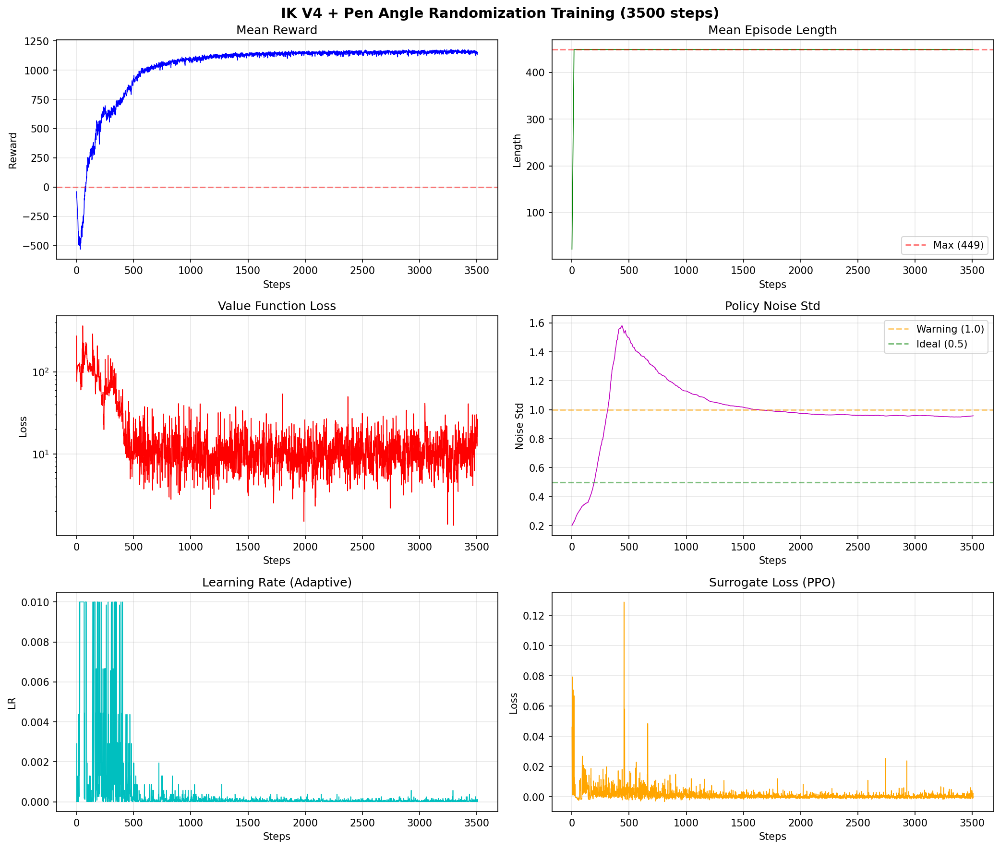

**학습 메트릭 분석**:

| 메트릭 | 초기값 | 최종값 | 평가 |
|--------|--------|--------|------|
| Mean Reward | -531 | **1,152** | ✓ 매우 좋음 |
| Episode Length | 21 | **449 (max)** | ✓ 완벽 |
| Noise Std | 1.58 | **0.96** | ⚠️ 약간 높음 (이상적: 0.2~0.5) |
| Value Loss | 363 → 20 | 20.2 | ✓ 안정화 |
| Learning Rate | 0.01 | **~0** | ⚠️ Adaptive LR이 너무 빨리 감소 |

**Play 테스트 결과**:

```
Step 0: reward=-2.3859, phases=[APP:32, ALN:0, FINE:0, DESC:0, GRP:0], success=0
  → perp_dist=0.1758m (need <0.05), axis_dist=-0.4606m
  → dist_cap=0.4991m, dot=-0.3049

Step 100: reward=0.0081, phases=[APP:0, ALN:0, FINE:5, DESC:27, GRP:0], success=10
  → perp_dist=0.0513m, axis_dist=0.0418m
  → dist_cap=0.0781m, dot=-0.8964
  → on_correct_side=31.2%

Step 400: reward=0.4728, phases=[APP:0, ALN:0, FINE:2, DESC:29, GRP:1], success=11
  → perp_dist=0.0938m, axis_dist=0.1550m
  → dist_cap=0.1928m, dot=-0.5313
  → on_correct_side=12.5%
```

**Play 테스트 스크린샷** (문제 발생):

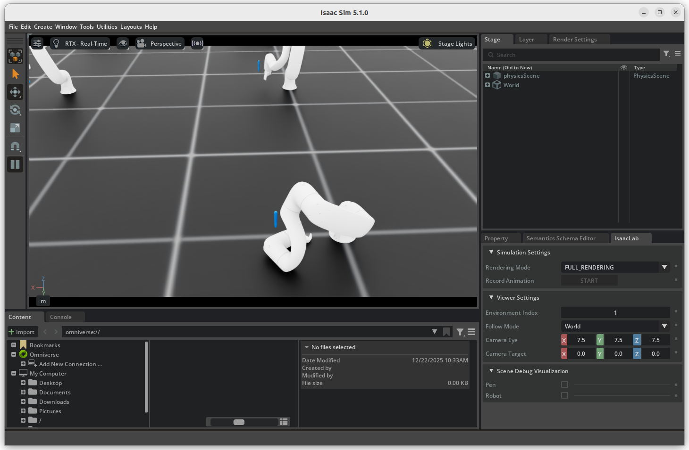

*그리퍼가 DESCEND 단계에서 자세를 유지하지 못하고 바닥으로 꼬라박는 모습*

**문제점 발견**:

1. **TCP DESCEND 하강 방향 버그**:
   - 기존 코드: `descend_dir = -pen_z` (펜 축 반대 방향)
   - 문제: 펜이 기울어지면 하강 방향도 기울어져서 옆으로 이동
   - 결과: 그리퍼가 바닥으로 꼬라박음

2. **자세 보정 속도 부족**:
   - 기존: `rotation_delta = angle * 0.5`
   - 하강 중 자세가 틀어지는 속도보다 보정이 느림
   - dot 값이 점점 악화 (-0.89 → -0.53)

3. **on_correct_side 급감**:
   - Step 0: 100% → Step 400: 12.5%
   - 그리퍼가 펜의 올바른 방향에서 접근하지 못함

**결론**: TCP DESCEND 버그 수정 + 정확도 향상을 위한 Curriculum Learning 필요 → **IK V5**

---

### IK V5 (TCP 버그 수정 + Curriculum Learning)

**날짜**: 2024-12-22

**V4 문제 분석**:
- TCP DESCEND 방향이 펜 축 방향(-pen_z)으로 되어 있어, 펜이 기울어지면 그리퍼가 옆으로 이동
- 자세 보정 속도가 하강 속도를 따라가지 못함
- 처음부터 30도 기울기로 학습하면 기본 동작 학습이 어려움

**V5 핵심 변경사항**:

**1. TCP DESCEND 버그 수정**:
```python
# 기존 (V4): 펜 축 방향 하강 (기울어지면 옆으로 이동)
descend_dir = -pen_z[descend_mask]

# 수정 (V5): 월드 Z축 방향 하강 (항상 아래로)
descend_dir = torch.zeros(num_descend, 3, device=self.device)
descend_dir[:, 2] = -1.0  # 월드 Z축 아래 방향
```

**2. 자세 보정 속도 강화**:
```python
# 기존 (V4)
rotation_delta = torch.clamp(angle, max=FINE_ALIGN_ROTATION_SPEED * 0.5)

# 수정 (V5)
DESCEND_POSE_CORRECTION_GAIN = 1.5  # 기존 0.5 → 1.5
rotation_delta = torch.clamp(angle, max=FINE_ALIGN_ROTATION_SPEED * DESCEND_POSE_CORRECTION_GAIN)
```

**3. Curriculum Learning**:

| Level | 펜 최대 기울기 | 설명 |
|-------|---------------|------|
| 0 | 0° (수직) | 기본 동작 학습 |
| 1 | 10° | 약간의 변형 적응 |
| 2 | 20° | 중간 난이도 |
| 3 | 30° | 최종 목표 |

**4. 기타 상수 조정**:
| 상수 | V4 | V5 |
|------|-----|-----|
| FINE_ALIGN_ROTATION_SPEED | 0.02 | **0.03** |
| DESCEND_SPEED | 0.003 | **0.002** (더 정밀) |

**파일 구조**:
```
pen_grasp_rl/
├── envs/
│   └── e0509_ik_env_v5.py   # V5 환경 (TCP 수정 + Curriculum)
└── scripts/
    ├── train_ik_v5.py       # 학습 (--level 옵션)
    └── play_ik_v5.py        # 테스트
```

**실행 방법**:

```bash
# 1. IsaacLab으로 동기화
cp ~/CoWriteBotRL/pen_grasp_rl/envs/e0509_ik_env_v5.py ~/IsaacLab/pen_grasp_rl/envs/
cp ~/CoWriteBotRL/pen_grasp_rl/envs/__init__.py ~/IsaacLab/pen_grasp_rl/envs/
cp ~/CoWriteBotRL/pen_grasp_rl/scripts/train_ik_v5.py ~/IsaacLab/pen_grasp_rl/scripts/
cp ~/CoWriteBotRL/pen_grasp_rl/scripts/play_ik_v5.py ~/IsaacLab/pen_grasp_rl/scripts/

# 2. Level 0 학습 시작 (펜 수직)
cd ~/IsaacLab && source ~/isaacsim_env/bin/activate
python pen_grasp_rl/scripts/train_ik_v5.py --headless --num_envs 4096 --level 0

# 3. Level 0 완료 후 → Level 1 학습
python pen_grasp_rl/scripts/train_ik_v5.py --headless --num_envs 4096 --level 1 \
    --checkpoint ./pen_grasp_rl/logs/e0509_ik_v5_l0/model_4999.pt

# 4. 테스트
python pen_grasp_rl/scripts/play_ik_v5.py --checkpoint ./path/to/model.pt --level 0
```

**학습 전략**:
1. Level 0에서 수렴시키기 (5000 iterations)
2. Level 1로 체크포인트 이어서 학습 (3000~5000 iterations)
3. 반복해서 Level 3까지 진행
4. 발산 발생 시 `--fixed_lr` 옵션 사용

**학습 결과**:

### V5.2 학습 결과 (2024-12-22)

**변경사항 (V5.1 → V5.2)**:
- 단계 전환 조건 강화: 자세 + 위치 동시 체크
  - ALIGN → FINE_ALIGN: `dot < -0.85 AND perp_dist < 4cm`
  - FINE_ALIGN → DESCEND: `dot < -0.98 AND perp_dist < 3cm`

**학습 결과** (2000 steps):

| 지표 | V5.0 | V5.2 | 변화 |
|------|------|------|------|
| Mean Reward | 1,192 | **2,553** | +114% |
| Episode Length | 449 | 449 | 동일 |
| Noise Std | 0.69 | 1.32 | 아직 탐색 중 |

**학습 그래프**:

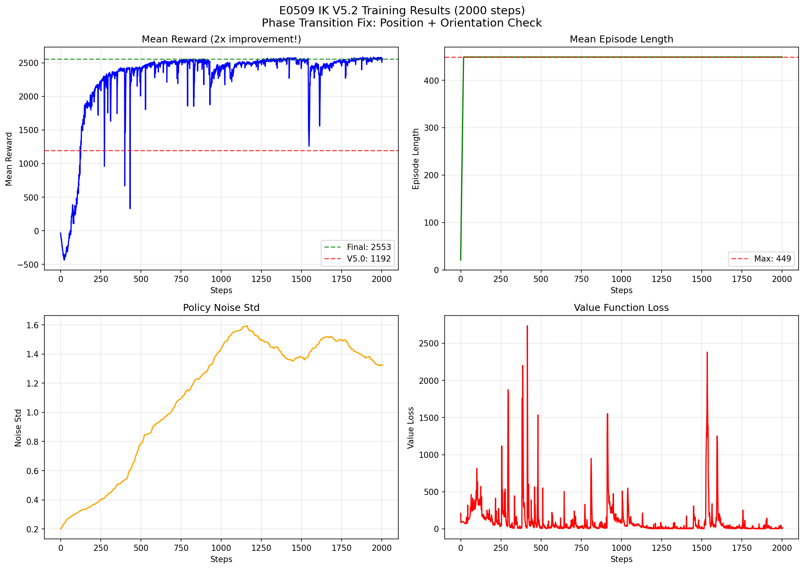

**Play 테스트 문제 발견**:
- 그리퍼가 **앞으로 드러눕는** 현상 발생
- `perp_dist`가 0.08~0.13m로 조건 미충족
- `dot`이 -0.4 ~ -0.7로 정렬 안 됨
- `on_correct_side`가 100% → 0%로 감소

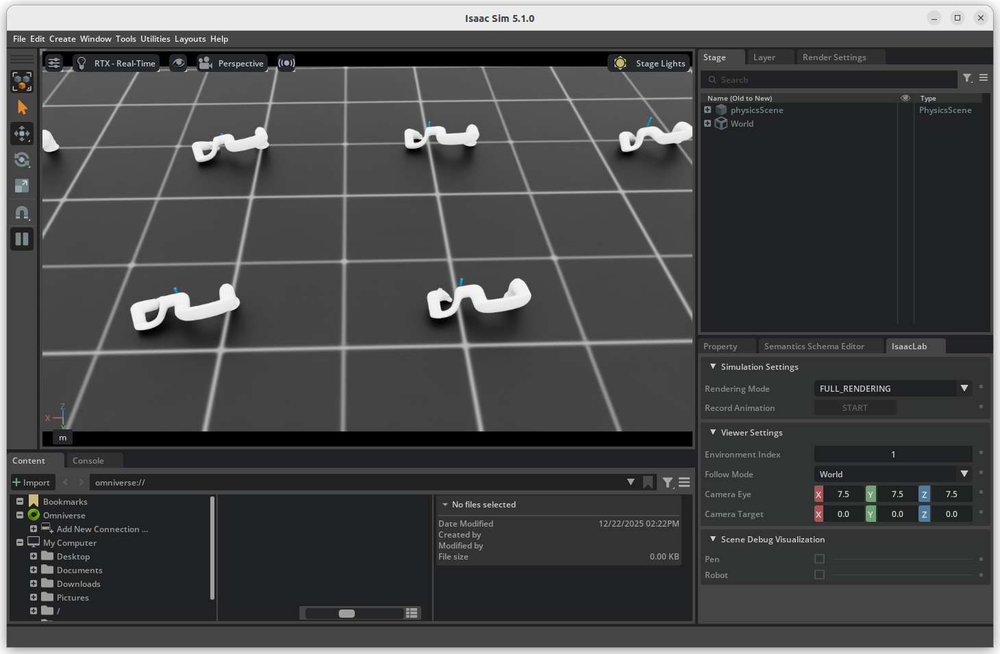

**원인 분석**:
```
APPROACH: perp_dist 줄이기 ✅
ALIGN: 자세만 reward, perp_dist reward 없음 ❌
→ RL: "perp_dist 커져도 상관없네, 자세만 맞추자"
→ 멀리서 펜을 향해 기울임 → 앞으로 드러눕음
```

### V5.3 수정 (2024-12-22)

**핵심 변경: End-to-End 스타일 Reward**

모든 RL 단계에서 위치 + 자세를 동시에 reward:

| 단계 | 기존 (V5.2) | 수정 (V5.3) |
|------|-------------|-------------|
| APPROACH | 위치만 | 위치 + **자세 추가** |
| ALIGN | 자세만 | **위치 + 자세** |

**V5.3 Play 테스트 결과** (5000 steps):
```
Step 100: phases=[APP:0, ALN:0, FINE:0, DESC:5, GRP:11], success=106
```

**핵심 성과**: success=106 달성! (V5.2의 0에서 대폭 개선)

**문제점 발견**:
1. 그리퍼가 완전히 닫히지 않음 (gripper_target=0.7)
2. GRASP 후 로봇팔이 아래로 흘러내림
3. 펜을 "잡았는지" 판단할 조건 없음

---

### V5.4 수정 (2024-12-22)

**핵심 변경: PHASE_LIFT + Good Grasp 조건**

**1. PHASE_LIFT 추가 (6단계)**:
```
0. APPROACH: 펜 축 방향에서 접근 (RL)
1. ALIGN: 자세 정렬 (RL)
2. FINE_ALIGN: 정밀 정렬 (TCP)
3. DESCEND: 펜 캡 방향 하강 (TCP)
4. GRASP: 그리퍼 닫기 + 30스텝 유지 (TCP)
5. LIFT: 펜 5cm 들어올리기 → 성공! (TCP)  ← 신규
```

**2. Good Grasp 조건 (펜이 제대로 잡혔는지 판단)**:
```python
good_grasp = (
    (perp_dist < 0.008) &           # 펜 축과 일치 (8mm)
    (dot < -0.98) &                 # 자세 정렬
    (gripper_amount > 0.8) &        # 그리퍼가 어느정도 닫힘
    (gripper_amount < 1.05)         # 완전히 닫힌 건 아님 (펜이 사이에 있음)
)
```

**원리**:
- 그리퍼에 1.1로 닫기 명령 → 펜이 있으면 ~0.9에서 멈춤 (펜에 걸림)
- 펜이 없으면 1.1까지 완전히 닫힘 → good_grasp 실패 (헛잡음)

**3. 그리퍼 닫기 강화**:
- `GRIPPER_CLOSE_TARGET`: 0.7 → **1.1** (확실히 닫으려고 시도)

**4. 성공 조건 변경**:
- 기존: `dist < 5mm & dot < -0.99 & gripper_closed`
- V5.4: `LIFT 완료 & good_grasp` (펜을 들어올렸고 + 제대로 잡고 있음)

**상수 설정**:
```python
# GRASP/LIFT 설정
GRIPPER_CLOSE_TARGET = 1.1        # 확실히 닫으려고 시도
LIFT_HEIGHT = 0.05                # 들어올리기 높이 5cm
LIFT_SPEED = 0.003                # 들어올리기 속도

# Good Grasp 조건
GOOD_GRASP_GRIPPER_MIN = 0.8      # 그리퍼가 어느정도 닫힘
GOOD_GRASP_GRIPPER_MAX = 1.05     # 완전히 닫힌 건 아님
GOOD_GRASP_PERP_DIST = 0.008      # 펜 축과 일치 (8mm)
GOOD_GRASP_DOT = -0.98            # 자세 정렬
```

**V5.3 학습 분석 (1532 iterations) - Adaptive LR 문제점**:

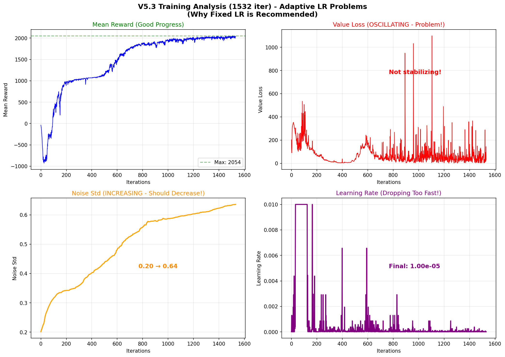

| 지표 | 초기값 | 최종값 | 문제점 |
|------|--------|--------|--------|
| Mean Reward | ~0 | **2,054** | ✓ 좋음 |
| Value Loss | ~200 | 1~1,098 (진동) | ❌ 안정화 안 됨 |
| Noise Std | 0.20 | **0.64** | ❌ 증가 (정상: 감소해야 함) |
| Learning Rate | 1.17e-05 | **1.00e-05** | ❌ 거의 0 수렴 |

**Adaptive LR 문제점 분석**:

1. **Value Loss 진동**: 202 → 37 → 196 → 26 → 4 → 61 (불안정)
   - 원인: Learning Rate가 너무 빨리 감소하여 학습이 제대로 안 됨

2. **Noise Std 증가**: 0.20 → 0.64 (비정상!)
   - 정상적인 학습: Noise Std가 **감소**해야 함 (탐색 → 활용)
   - 증가 = Policy가 불확실해지고 있음

3. **Learning Rate 소멸**: ~0.00001 (거의 0)
   - Adaptive LR이 KL Divergence 기반으로 조절
   - 불안정한 상황에서 LR을 과도하게 줄임 → 학습 정체

**Fixed LR 권장 이유**:

| 항목 | Adaptive LR | Fixed LR |
|------|-------------|----------|
| 장점 | 자동 조절 | 안정적, 예측 가능 |
| 단점 | 불안정 시 폭주/소멸 | 수동 튜닝 필요 |
| 복잡한 환경 | ❌ 위험 | ✓ 안전 |
| 권장 상황 | 단순 환경 | **다단계 환경, Curriculum** |

**결론**: V5.4 학습 시 `--fixed_lr` 옵션 사용 권장

**학습 명령어**:
```bash
source ~/isaacsim_env/bin/activate && cd ~/IsaacLab

# Fixed LR 사용 (권장)
python pen_grasp_rl/scripts/train_ik_v5.py --headless --num_envs 4096 --max_iterations 5000 --level 0 --fixed_lr
```

**테스트 명령어**:
```bash
python pen_grasp_rl/scripts/play_ik_v5.py --checkpoint /path/to/model.pt --level 0
```

---

## 다음 단계

1. [x] V1 학습 분석 완료
2. [x] V2 학습 및 분석 완료
3. [x] V3 (Pre-grasp + 지수적 정렬 보상) 코드 수정
4. [x] V4 학습 (작업 공간 기반 관절 한계) - 관절 한계 너무 제한적
5. [x] V5 학습 (관절 한계 확장) - 그리퍼가 아래에서 위로 올려다봄 (실패)
6. [x] **IK 환경 추가** (Task Space Control)
7. [x] **IK V1 학습** - DESCEND 진입 실패 (정렬 조건 못 충족)
8. [x] **IK V2 수정** - ALIGN 단계 추가 + 펜 캡 위치 기준 생성
9. [x] **IK V2 학습** - 그리퍼가 펜캡 "위"가 아닌 "옆"으로 접근 (문제 발견)
10. [x] **IK V3 구현** - 펜 축 기준 접근 + 충돌 페널티 + 단계 체류 페널티
11. [x] **IK V3 학습** - Mean Reward +1,621 달성! (2025 iterations)
12. [x] **IK V3 Play 테스트** - 조건 엄격, GRASP 진입 실패
13. [x] **IK V4 구현** - Hybrid RL + TCP Control
14. [x] **IK V4 학습** - success=3, DESCEND 진입 성공!
15. [x] **IK V4 Play 테스트** - Hybrid 접근 검증 성공
16. [x] **IK V4 + 각도 랜덤화 (roll/pitch)** - 발산 (Adaptive LR + Noise Std 폭발)
17. [x] **IK V4 + 각도 랜덤화 (Z축 원뿔)** - Mean Reward 1,152 달성 (3500 steps)
18. [x] **IK V4 Play 테스트** - TCP DESCEND 버그 발견 (그리퍼 바닥으로 꼬라박음)
19. [x] **IK V5 구현** - TCP 버그 수정 + Curriculum Learning
20. [x] **IK V5.2 학습** - 전환 조건 강화 (자세+위치), Mean Reward 2,553 (+114%)
21. [x] **IK V5.2 Play 테스트** - 앞으로 드러눕는 문제 발견 (ALIGN에서 위치 reward 없음)
22. [x] **IK V5.3 수정** - End-to-End 스타일 reward (모든 단계에서 위치+자세 동시)
23. [x] **IK V5.3 Play 테스트** - success=106 달성! 그리퍼 닫기/LIFT 문제 발견
24. [x] **IK V5.4 수정** - PHASE_LIFT 추가 + Good Grasp 조건 + 그리퍼 1.1
25. [x] **IK V5.4 학습 (30K)** - Reward Hacking 발견 (로봇 뒤집어짐)
26. [x] **IK V5.5 수정** - 위치 조건부 자세 reward
27. [x] **IK V5.6 수정** - 점진적 보상 증가 + Phase 체류 패널티
28. [x] **IK V5.6 학습 (4K)** - DESCEND 87%, GRASP 0% (전환 실패)
29. [x] **IK V5.7 수정** - 5단계로 간소화 (FINE_ALIGN 제거)
30. [x] **IK V5.7 학습 (1K)** - DESCEND 94%, GRASP 0% (TCP 속도 문제)
31. [x] **IK V5.8 수정** - 전면 RL 제어 (TCP 하드코딩 제거)
32. [ ] **IK V5.8 학습** - 펜 수직, 전면 RL 제어 ← 현재
33. [ ] **IK V5 Level 1~3 학습** - 점진적 난이도 증가
34. [ ] 성공률 > 50% 확인 후 다음 단계 진행
35. [ ] Feasibility Classifier 학습 (MLP)
36. [ ] Sim2Real 전이 테스트

---

## 변경 이력

| 날짜 | 변경 | 커밋 |
|------|------|------|
| 2024-12-17 | Direct 환경 초기 구현 (V1) | `3472b87` |
| 2024-12-17 | 단계 순서 변경 (V2): ALIGN → APPROACH → GRASP | `c3fe5c3` |
| 2024-12-18 | Pre-grasp 방식 (V3) + 지수적 정렬 보상 + 특이점 회피 | - |
| 2024-12-18 | V4: 작업 공간 기반 관절 한계 + action_scale 축소 + 특이점 페널티 제거 | - |
| 2024-12-18 | V5: 관절 한계 확장 (그리퍼 아래 향하도록) | `1d71d76` |
| 2024-12-18 | IK V1: Task Space Control 환경 추가 | `6318733` |
| 2024-12-18 | IK V2: ALIGN 단계 추가 + 펜 캡 위치 기준 생성 | - |
| 2024-12-18 | IK V2 학습 결과: 그리퍼가 펜캡 "옆"으로 접근 문제 발견 | - |
| 2024-12-19 | **IK V3**: 펜 축 기준 접근 + 충돌 페널티 + 단계 체류 페널티 | `389e453` |
| 2024-12-19 | **IK V3 학습**: Mean Reward +1,621 (2025 iter) | - |
| 2024-12-19 | **IK V3 Play 테스트**: 조건 엄격, GRASP 진입 실패 | - |
| 2024-12-19 | **IK V4**: Hybrid RL + TCP Control | - |
| 2024-12-19 | **IK V4 학습**: success=3, DESCEND 진입 성공 (1470 iter) | - |
| 2024-12-19 | **IK V4 + 각도 랜덤화 (roll/pitch)**: 발산 (Noise Std 10.5+, Adaptive LR 폭주) | `1a1f93f` |
| 2024-12-19 | **IK V4 + 각도 랜덤화 (Z축 원뿔)**: 정확한 최대 30도 기울기 제한 | `712c927` |
| 2024-12-22 | **IK V4 + 각도 랜덤화 학습**: Mean Reward 1,152 (3500 steps) | - |
| 2024-12-22 | **IK V4 Play 테스트**: TCP DESCEND 버그 발견 (그리퍼 바닥으로 꼬라박음) | - |
| 2024-12-22 | **IK V5 구현**: TCP 버그 수정 (월드 Z축 하강) + Curriculum Learning | `fa8b330` |
| 2024-12-22 | **IK V5.2**: 전환 조건 강화 (자세+위치 동시 체크) | `18345f4` |
| 2024-12-22 | **IK V5.2 학습**: Mean Reward 2,553 (+114%), Play에서 앞으로 드러눕는 문제 발견 | - |
| 2024-12-22 | **IK V5.3**: End-to-End 스타일 reward (모든 단계에서 위치+자세 동시) | - |
| 2024-12-22 | **IK V5.3 Play 테스트**: success=106 달성! 그리퍼 닫기/LIFT 문제 발견 | - |
| 2024-12-22 | **IK V5.4**: PHASE_LIFT 추가 + Good Grasp 조건 + 그리퍼 1.1 | `2495832` |
| 2024-12-23 | **IK V5.4 학습 (30K)**: Reward Hacking 발견 - 로봇 뒤집어짐 | - |
| 2024-12-23 | **IK V5.5**: 위치 조건부 자세 reward (exponential) | - |
| 2024-12-23 | **IK V5.6**: 점진적 보상 증가 + Phase 체류 패널티 | - |
| 2024-12-23 | **IK V5.6 학습 (4K)**: DESCEND 87%, GRASP 0% (전환 실패) | - |
| 2024-12-23 | **IK V5.7**: 5단계로 간소화 (FINE_ALIGN 제거) | `9c8e149` |
| 2024-12-23 | **IK V5.7 학습 (1K)**: DESCEND 94%, GRASP 0% (TCP 속도 문제) | - |
| 2024-12-23 | **IK V5.8**: 전면 RL 제어 (TCP 하드코딩 제거) | `e8a5075` |
| 2024-12-23 | **IK V5.9**: LIFT 제거 + Hybrid Readiness 보상 | - |
| 2024-12-23 | **IK V6**: 3DoF 위치 제어 + 자동 자세 정렬 (핵심 설계 변경) | - |

---

## IK V5.4 학습 결과 (30K iterations) - Reward Hacking 발견

**학습 환경**:
- Level 0 (펜 수직)
- 30,000 iterations
- Fixed LR

**학습 그래프**:

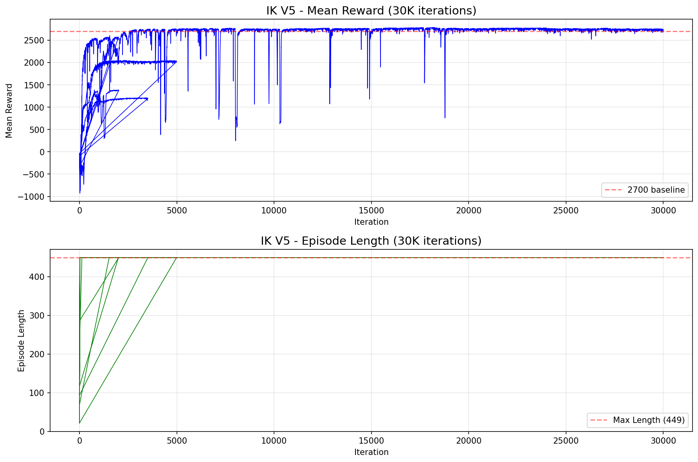

**수치 결과**:

| 항목 | 시작 | 최종 | 비고 |
|------|------|------|------|
| Mean Reward | -112 | 2,713 | 최대 2,785 |
| Episode Length | 141 | 449 | **max length 도달 (timeout)** |
| Learning Rate | 0.000256 | 0.0001 | Fixed LR decay |

**Play 테스트 결과 (model_29999.pt)**:

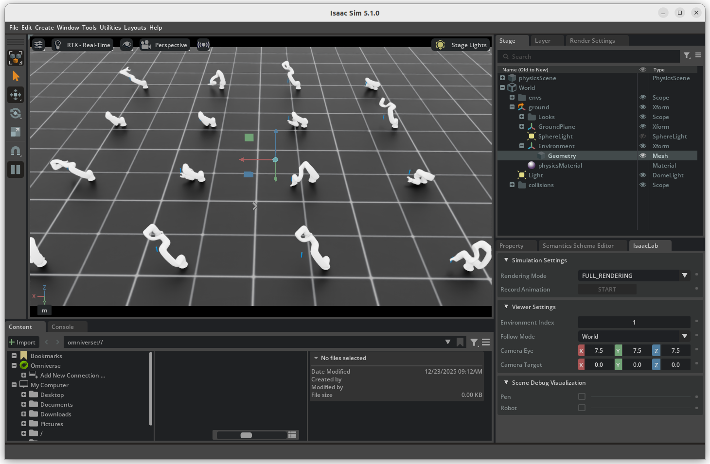

```
최종 단계 분포:
  APPROACH=2, ALIGN=12, FINE_ALIGN=2
  DESCEND=0, GRASP=0, LIFT=0
총 성공 횟수: 0
```

**문제 발견: Reward Hacking**

로봇이 뒤집어지거나 똬리를 틀면서 펜에 접근하지 않음:
- `perp_dist`: 0.04~0.12m (필요: < 0.008m) → 10배 이상 멀리
- `dot`: -0.01 ~ -0.46 (필요: < -0.98) → 자세 정렬 안됨
- DESCEND, GRASP, LIFT 진입: **0회**
- Episode Length 449 (timeout) → **성공 종료가 아닌 시간 초과**

**원인 분석**:

V5.3에서 APPROACH 단계에 자세 reward를 **독립적으로** 추가한 것이 문제:

```python
# V5.3/V5.4 APPROACH (문제)
rewards += rew_scale_perp_dist * perpendicular_dist      # -5.0 * 0.1 = -0.5
rewards += rew_scale_axis_dist * axis_dist               # -2.0 * 0.4 = -0.8
rewards += rew_scale_align_orientation * 0.5 * align_quality  # +3.0 * 0.5 * 1.0 = +1.5
# 합계: -0.5 - 0.8 + 1.5 = +0.2 (양수!)
```

**위치가 멀어도 자세만 맞추면 양수 reward** → 로봇이 멀리서 자세만 바꿈 → IK가 이상한 해 → 로봇 뒤집어짐

---

## IK V5.5 수정 - 위치 조건부 자세 Reward

**핵심 변경**: 자세 reward에 위치 조건부 가중치 (exponential) 적용

```python
# V5.5 APPROACH (수정)
# 거리가 가까울수록 자세 reward 가중치가 exponential하게 증가
base_dist = 0.1  # 기준 거리 10cm
scale = 20.0
position_weight = torch.exp((base_dist - perpendicular_dist) * scale)
position_weight = torch.clamp(position_weight, min=0, max=5.0)

rewards += rew_scale_align_orientation * 0.5 * align_quality * position_weight
```

**position_weight 효과**:

| perpendicular_dist | APPROACH weight | ALIGN weight |
|-------------------|-----------------|--------------|
| 0cm | 5.0 (max) | 5.0 (max) |
| 5cm | 2.7 | 1.0 |
| 10cm | 1.0 | 0.0 |
| 15cm | 0.4 | 0.0 |

**기대 효과**:
- 멀리서 자세만 바꿔도 reward 받는 문제 해결
- 위치가 가까워질수록 자세 reward 급격히 증가
- 로봇이 먼저 펜에 접근 → 그 다음 자세 정렬

---

### IK V5.5 학습 결과 (4K iterations)

**날짜**: 2024-12-23

**학습 결과**:

| 구간 | Mean Reward | VF Loss | Episode Length | 해석 |
|------|-------------|---------|----------------|------|
| 0-1K | avg=827 | avg=458 | 22→449 | 초기 학습, FINE_ALIGN 진입 시작 |
| 1K-2K | avg=3884 | avg=61 | 449 | **안정적**, 많은 env가 후반 phase 진입 |
| 2K-3K | avg=2601 (**↓**) | avg=1208 (**↑**) | 449 | **퇴화 구간!** VF Loss 지속적으로 높음 |
| 3K-4K | avg=3953 | avg=13 | 449 | 안정화됐지만 APPROACH에 갇힌 상태 |

**학습 그래프**:

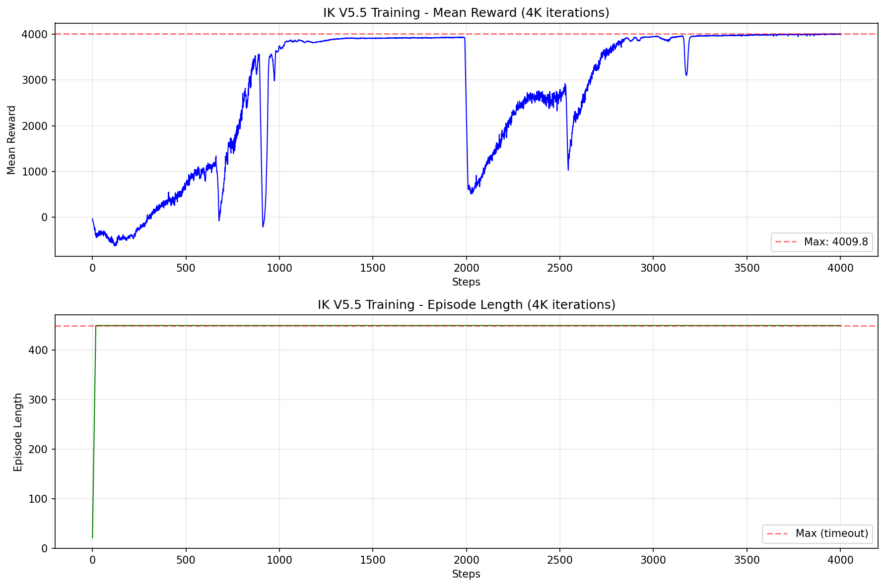

**Phase 분포 변화** (학습 중 확인):
- ~1500 iter: `APP:7037, ALN:235, FINE:920` → FINE_ALIGN 진입 성공!
- ~4000 iter: `APP:8192` → **모든 env가 APPROACH로 퇴화**

**문제 발견: 다른 형태의 Reward Hacking**

**원인 분석**:
1. `position_weight` max=5.0이 너무 높음
2. ALIGN에서 orientation reward가 최대 **15.0/step** (3.0 × 5.0)
3. 이 높은 reward 때문에 다음 phase로 전환하기보다 ALIGN에 머무르는 것이 유리
4. 불안정한 학습 → 전체가 APPROACH로 퇴화

**VF Loss Spike 분석**:
```
- step 894:  3648  (FINE_ALIGN 첫 진입)
- step 1993: 6652  (더 많은 env가 후반 phase 진입)
- step 2533: 7836  (최대 spike → 직후 퇴화 시작)
```

**퇴화 과정**:
1. 1K~2K: 많은 env가 FINE_ALIGN까지 진입
2. 2K~2.5K: ALIGN/FINE_ALIGN에서 높은 orientation reward로 머무름
3. 2.5K: VF Loss 폭발 (7836) → policy 불안정
4. 3K~4K: 모든 env가 APPROACH로 회귀, 안정화

**수정 필요 사항**:

1. **position_weight max 축소**: 5.0 → 2.0
2. **또는** 다음 phase 진입 보너스 증가
3. **또는** 이전 phase 체류 시간에 따른 패널티

---

## IK V5.6 - 점진적 보상 증가 + 3가지 수정

**날짜**: 2024-12-23

**V5.5 문제점**: position_weight max=5.0이 너무 높아 ALIGN에서 ~27/step → 다음 phase 전환보다 머무르는 게 유리

### 설계 원칙: 점진적 보상 증가

| 단계 | 목표 보상/step | 이유 |
|------|---------------|------|
| APPROACH | 3-4 | 탐색 단계, 낮게 시작 |
| ALIGN | 4-5 | 자세 정렬 시작 |
| FINE_ALIGN | 5-6 | 정밀 정렬 |
| DESCEND | 6-7 | 하강 진행 |
| GRASP | 8-10 | 성공에 가까울수록 높음 |

**원리**: Value function이 "앞으로 더 큰 보상이 온다"는 것을 학습 → 목표 지향적 policy

### 변경 사항

**1. 보상 스케일 조정 (점진적 증가)**:
```python
# APPROACH (3-4/step)
rew_scale_approach_progress = 3.0   # 10.0 → 3.0
rew_scale_on_axis_bonus = 1.5       # 2.0 → 1.5

# ALIGN (4-5/step)
rew_scale_align_orientation = 2.0   # 3.0 → 2.0
rew_scale_exponential_align = 0.3   # 0.5 → 0.3

# FINE_ALIGN (5-6/step)
rew_scale_fine_align = 6.0          # 2.0 → 6.0

# DESCEND (6-7/step)
rew_scale_descend = 7.0             # 3.0 → 7.0

# GRASP (8-10/step)
rew_scale_grasp_close = 4.0         # 5.0 → 4.0
rew_scale_grasp_hold = 6.0          # 10.0 → 6.0
```

**2. position_weight max 축소**:
```python
position_weight = torch.clamp(position_weight, min=0, max=2.0)  # 5.0 → 2.0
```
- APPROACH 자세 reward 최대: 2.0 × 0.5 × 2.0 = 2.0/step
- ALIGN 자세 reward 최대: 2.0 × 1.0 × 2.0 = 4.0/step

**3. Phase 전환 보상 증가**:
```python
rew_scale_phase_transition = 50.0   # 15.0 → 50.0
```
- 전환 보상 = 현재 phase ~10 step과 동등 → 강력한 유인

**4. Phase 체류 패널티 추가**:
```python
rew_scale_phase_stagnation = -0.01  # 신규
# 100 step 머무르면 -1.0 패널티
rewards += rew_scale_phase_stagnation * phase_step_count
```

### 예상 효과

| 문제 | V5.5 | V5.6 |
|------|------|------|
| ALIGN reward 폭발 | 최대 27/step | 최대 ~6/step |
| 전환 유인 | 15.0 (ALIGN 1 step 미만) | 50.0 (ALIGN ~10 step) |
| 체류 패널티 | 없음 | -0.01/step |
| 다음 phase 가치 | 불명확 | 점진적으로 증가 |

**다음 단계**: V5.6 학습 후 결과 확인

---

## IK V5.7 - 5단계로 간소화 (FINE_ALIGN 제거)

**날짜**: 2024-12-23

### V5.6 학습 분석 (4000 iterations)

V5.6 학습 결과:
- DESCEND 단계: 87.3% 도달
- GRASP 단계: 0% (전환 실패)

**문제점**: DESCEND → GRASP 전환이 안 됨
- 조건: `dist_cap < 2cm` AND `dot < -0.99`
- ALIGN의 exponential 보너스로 이미 dot ~0.98까지 도달
- 별도 FINE_ALIGN 단계 불필요

### V5.7 변경사항

**1. 6단계 → 5단계 간소화**:
```
V5.6 (6단계):
APPROACH → ALIGN → FINE_ALIGN → DESCEND → GRASP → LIFT

V5.7 (5단계):
APPROACH → ALIGN → DESCEND → GRASP → LIFT
```

**2. DESCEND 단계 개선 (FINE_ALIGN 기능 통합)**:
- 정밀 정렬 + 캡 접근을 동시 수행
- `perpendicular_dist` → `distance_to_cap` 기반 보상 변경
- 정밀 정렬에 exponential 보너스 추가 (dot > -0.95부터)

```python
# DESCEND 보상 (V5.7)
# 1. 정렬 보상 (선형)
rewards += rew_scale_descend * align_progress  # -dot

# 2. 정밀 정렬 exponential 보너스
if align_progress > 0.95:
    fine_exp = exp((align_progress - 0.95) * 30.0)
    rewards += 2.0 * fine_exp

# 3. 캡 접근 보상 (distance_to_cap 기반)
cap_approach = exp(-distance_to_cap * 20.0)
rewards += 5.0 * cap_approach

# 4. 캡 접근 진행 보상
descend_progress = prev_dist - distance_to_cap
rewards += 10.0 * clamp(descend_progress * 100, 0, 1)
```

**3. 전환 조건 조정**:

| 전환 | V5.6 | V5.7 |
|------|------|------|
| ALIGN → DESCEND | dot < -0.98, perp < 3cm | dot < -0.85, perp < 4cm |
| DESCEND → GRASP | dist_cap < 2cm | dist_cap < 2cm, dot < -0.98 |

**4. 코드 정리**:
- `PHASE_FINE_ALIGN` 상수 제거
- `fine_align_target_pos` → `descend_target_pos` 변경
- `FINE_ALIGN_ROTATION_SPEED` → `TCP_ROTATION_SPEED` 변경
- TensorBoard 로깅에서 `fine_align_ratio` 제거

### 예상 효과

| 항목 | V5.6 | V5.7 |
|------|------|------|
| 단계 수 | 6 | 5 |
| DESCEND 역할 | 캡 접근만 | 정밀 정렬 + 캡 접근 |
| GRASP 진입 조건 | dist_cap < 2cm | dist_cap < 2cm + dot < -0.98 |
| 전환 복잡도 | 높음 (2번 전환) | 낮음 (1번 전환) |

**다음 단계**: V5.7 학습 후 GRASP 도달률 확인

---

## IK V5.8 - 전면 RL 제어 (TCP 하드코딩 제거)

**날짜**: 2024-12-23

### V5.7 학습 분석 (1000 iterations)

V5.7 학습 결과:
- DESCEND 단계: 94% 도달
- GRASP 단계: 0% (여전히 전환 실패)
- Value function loss: 5000 → 1800 (불안정)

**문제점**: TCP 하드코딩 속도가 너무 느림
- `DESCEND_SPEED = 0.002` (2mm/step)
- RL → TCP 전환 시 Value function 불연속

**근본적 의문**: TCP 제어가 정말 필요한가?
- 모든 단계에서 IK는 사용 (Cartesian → Joint 변환)
- 차이점: 누가 Cartesian 명령을 주는가 (RL vs 하드코딩)
- RL이 APPROACH/ALIGN을 학습했다면, DESCEND/GRASP/LIFT도 학습 가능

### V5.8 변경사항

**1. 전면 RL 제어**:
```
V5.7 (Hybrid):
APPROACH/ALIGN: RL 정책 → IK
DESCEND/GRASP/LIFT: 하드코딩 TCP → IK

V5.8 (Full RL):
모든 단계: RL 정책 → IK
그리퍼만: 단계별 open/close (단순 규칙)
```

**2. 코드 단순화**:
```python
# V5.7 (복잡)
def _apply_action(self):
    if tcp_mask.any():
        tcp_actions = self._compute_tcp_actions(...)  # 100줄+ 하드코딩
        scaled_actions[tcp_mask] = tcp_actions[tcp_mask]
    ...

# V5.8 (단순)
def _apply_action(self):
    scaled_actions = self.actions * self.action_scale  # RL 출력 그대로 사용
    ...
```

**3. 관찰 공간 변경**:
- V5.7: 37차원 (tcp_active 포함)
- V5.8: 36차원 (tcp_active 제거 - 더 이상 의미 없음)

**4. 보상 함수 업데이트**:

GRASP 단계:
```python
# 위치 유지 보상 (RL이 가만히 있도록 유도)
rewards += 5.0 * exp(-distance_to_cap * 50.0)

# grasp_step_count 증가 (TCP에서 이동)
self.grasp_step_count[grasp_mask] += 1
```

LIFT 단계:
```python
# 높이 상승 보상
current_height = grasp_pos[:, 2] - lift_start_pos[:, 2]
rewards += 10.0 * clamp(current_height / LIFT_HEIGHT, max=1.0)

# lift_complete 체크 (TCP에서 이동)
if current_height >= LIFT_HEIGHT:
    self.lift_complete[idx] = True
```

**5. 제거된 항목**:
- `_compute_tcp_actions()` 함수 (83줄)
- `TCP_ROTATION_SPEED`, `DESCEND_SPEED`, `LIFT_SPEED` 상수
- `tcp_active` 관찰값

### 예상 효과

| 항목 | V5.7 (Hybrid) | V5.8 (Full RL) |
|------|---------------|----------------|
| 제어 방식 | RL + TCP 혼합 | 전부 RL |
| Value function | 불연속 (전환점) | 연속 |
| 코드 복잡도 | 높음 | 낮음 |
| 적응성 | TCP는 고정 | 모든 상황 학습 |
| DESCEND 속도 | 2mm/step 고정 | RL이 최적화 |

**핵심 장점**:
1. Value function이 연속적으로 학습 가능
2. RL이 상황에 맞게 속도/동작 조절
3. 코드 단순화 (-80줄)

**다음 단계**: V5.8 학습 후 GRASP 도달률 확인

---

## IK V5.9 - LIFT 제거 + Hybrid Readiness 보상

**날짜**: 2024-12-23

### V5.8 학습 분석 (1700 iterations)

V5.8 학습 결과:
- DESCEND 단계: 96.8% 도달
- GRASP 단계: 0% (여전히 전환 실패)
- Value function loss: 256 (V5.7 대비 크게 개선)
- Mean Episode Length: 449 (항상 타임아웃)

**Play 테스트 결과**:
- 학습 중: DESCEND 96.8%
- Play 중: 대부분 ALIGN에서 정체
- perp_dist: 0.04~0.12m (조건: <0.04m)
- dot: -0.4 ~ -0.9 (조건: <-0.85)

**문제 분석**:
1. 학습 중 탐색 노이즈로 우연히 조건 달성
2. Play (deterministic)에서는 조건 경계만 맴돌기
3. 두 조건 동시 달성에 대한 보상 신호 부재

### V5.9 변경사항

**1. LIFT 단계 제거 (5단계 → 4단계)**:
```
V5.8: APPROACH → ALIGN → DESCEND → GRASP → LIFT → 성공
V5.9: APPROACH → ALIGN → DESCEND → GRASP → 성공
```

성공 조건 단순화:
- V5.8: LIFT 완료 + Good Grasp
- V5.9: GRASP + Good Grasp + 30스텝 유지

**2. Hybrid Readiness 보상 추가**:

전환 준비도(Readiness): 다음 단계 전환 조건에 얼마나 가까운지를 연속적 보상으로 제공

```python
# ALIGN → DESCEND 전환 조건
# dot < -0.85 AND perp_dist < 0.04m

# Linear readiness (0~1로 정규화)
dot_linear = clamp((-dot - 0.5) / 0.35, 0, 1)
dist_linear = clamp((0.08 - perp_dist) / 0.04, 0, 1)

# Hybrid 변환 적용
dot_readiness = hybrid_readiness(dot_linear)
dist_readiness = hybrid_readiness(dist_linear)

# 곱으로 계산: 둘 다 높아야 높은 보상
transition_readiness = dot_readiness × dist_readiness
rewards += 5.0 * transition_readiness
```

**3. Hybrid Readiness 함수**:

0~0.5: Sigmoid 스타일 (중간에서 급격)
0.5~1.0: Exponential 스타일 (목표에서 급격)

```
보상
1.0 |                          /
    |                        /   ← exponential
0.5 |                     /
    |                  /         ← sigmoid
0.0 |________________/
    0              0.5           1
```

| 입력 x | 출력 (hybrid) | 특성 |
|--------|---------------|------|
| 0.0 | ~0.05 | 완만 시작 |
| 0.25 | ~0.18 | sigmoid 구간 |
| 0.5 | 0.5 | 경계점 |
| 0.75 | ~0.75 | exponential 구간 |
| 1.0 | 1.0 | 급격 마무리 |

**4. 적용 위치**:

| 전환 | 조건 | Readiness 보상 |
|------|------|----------------|
| ALIGN → DESCEND | dot < -0.85, perp_dist < 0.04 | dot_r × dist_r |
| DESCEND → GRASP | dot < -0.98, dist_cap < 0.02 | dot_r × dist_r |

### 핵심 아이디어

**문제**: 하드 임계값 전환은 "거의 도달" 상태에 gradient 신호 없음
**해결**: 두 조건의 곱으로 보상 → 동시 달성 유도

| dot_r | dist_r | 보상 (곱) |
|-------|--------|-----------|
| 1.0 | 0.0 | **0.0** (한쪽만 좋아도 안됨) |
| 0.0 | 1.0 | **0.0** |
| 0.8 | 0.8 | **0.64** |
| 1.0 | 1.0 | **1.0** (둘 다 좋아야 최대) |

**다음 단계**: V5.9 학습 후 GRASP 도달률 확인

---

## IK V6 - 3DoF 위치 제어 + 자동 자세 정렬 (핵심 설계 변경)

**날짜**: 2024-12-23

### V5.x 시리즈의 근본적 한계

V5.x의 문제점:
- **DESCEND 96~97% 도달, GRASP 0%**
- 전환 조건: `dist_to_cap < 2cm AND dot < -0.98` 동시 달성 불가
- RL이 6DoF(위치+자세)를 동시에 학습해야 함 → 탐색 공간이 너무 넓음
- Readiness 보상, Curriculum Learning 등 시도했지만 근본 해결 안됨

### V6 핵심 아이디어

**RL 부담 감소**: 자세는 자동 계산, RL은 위치만 학습

```
V5.9: RL이 6DoF 제어 (위치 + 자세 모두 학습)
       → 자세 정렬 조건(dot < -0.98) 달성 실패

V6:   RL이 3DoF 제어 (위치만 학습)
       + 자세는 펜 축 기반 자동 계산 → IK가 처리
       → 자세 정렬 보장, RL은 위치만 집중
```

### V6 vs V5.9 비교

| 항목 | V5.9 | V6 |
|------|------|-----|
| **RL 액션** | 6DoF (Δx,Δy,Δz,Δr,Δp,Δyaw) | **3DoF (Δx,Δy,Δz)** |
| **자세 제어** | RL이 학습 | **자동 계산 (펜 축 기반)** |
| **단계 수** | 4단계 (APP→ALN→DESC→GRP) | **2단계 (APP→GRP)** |
| **관찰 차원** | 36 | **24** |
| **성공 조건** | perp_dist + dot + gripper | **perp_dist + gripper** |

### 자동 자세 계산 (`_compute_auto_orientation`)

그리퍼 Z축이 펜 Z축 반대 방향을 향하도록 자동 계산:

```python
def _compute_auto_orientation(self):
    pen_z = self._get_pen_z_axis()
    
    # 그리퍼 Z축 = -펜 Z축 (펜을 위에서 잡음)
    gripper_z = -pen_z
    
    # 그리퍼 X축: 월드 Z축과 그리퍼 Z축의 외적
    world_z = [0, 0, 1]
    gripper_x = cross(world_z, gripper_z)
    
    # 그리퍼 Y축: Z × X
    gripper_y = cross(gripper_z, gripper_x)
    
    # 회전 행렬 → 쿼터니언 변환
    rot_matrix = [gripper_x, gripper_y, gripper_z]
    return quat_from_matrix(rot_matrix)
```

### 액션 적용 흐름

```
RL 출력: [Δx, Δy, Δz]  (3DoF)
           ↓
자동 자세 계산: target_quat = _compute_auto_orientation()
           ↓
자세 변화량 계산: rot_delta = target_quat × inv(current_quat)
           ↓
스케일링: rot_delta_scaled = rot_delta × 0.3  (30%씩 접근)
           ↓
IK 명령 조합: [Δx, Δy, Δz, Δrx, Δry, Δrz]  (6DoF)
           ↓
IK 컨트롤러: 관절 위치 계산
```

### 단계 단순화

```
V5.9 (4단계):
  APPROACH → ALIGN → DESCEND → GRASP → 성공

V6 (2단계):
  APPROACH → GRASP → 성공
```

- **APPROACH**: 펜 캡 위치로 접근 (자세는 자동)
- **GRASP**: 그리퍼 닫기 → Good Grasp + 30스텝 유지 → 성공

### 성공 조건 변경

```python
# V5.9 Good Grasp 조건
good_grasp = (
    perp_dist < 0.015 AND       # 펜 축 거리
    dot < -0.98 AND             # 자세 정렬 ← 문제!
    gripper_amount ∈ [0.8, 1.05]  # 그리퍼 상태
)

# V6 Good Grasp 조건 (dot 제거!)
good_grasp = (
    perp_dist < 0.015 AND       # 펜 축 거리
    gripper_amount ∈ [0.8, 1.05]  # 그리퍼 상태
    # dot 조건 제거! (자세는 자동이므로)
)
```

### 생성된 파일

```
pen_grasp_rl/
├── envs/
│   └── e0509_ik_env_v6.py     # V6 환경
└── scripts/
    ├── train_v6.py            # V6 학습 스크립트
    └── play_v6.py             # V6 테스트 스크립트
```

### 학습 명령어

```bash
cd ~/IsaacLab
source ~/isaacsim_env/bin/activate

# Level 0 (펜 수직)
python pen_grasp_rl/scripts/train_v6.py --headless --num_envs 4096 --level 0

# Fixed LR (안정적)
python pen_grasp_rl/scripts/train_v6.py --headless --num_envs 4096 --level 0 --fixed_lr
```

### 핵심 기대 효과

1. **자세 정렬 보장**: 펜 축 기반 자동 계산 → dot 조건 자동 달성
2. **탐색 공간 축소**: 6DoF → 3DoF → 학습 효율 향상
3. **단계 단순화**: 4단계 → 2단계 → 전환 실패 가능성 감소
4. **성공 조건 단순화**: dot 조건 제거 → 위치만 잘 맞추면 성공

### V6 학습 결과 (1100 iterations)

**학습 그래프**:

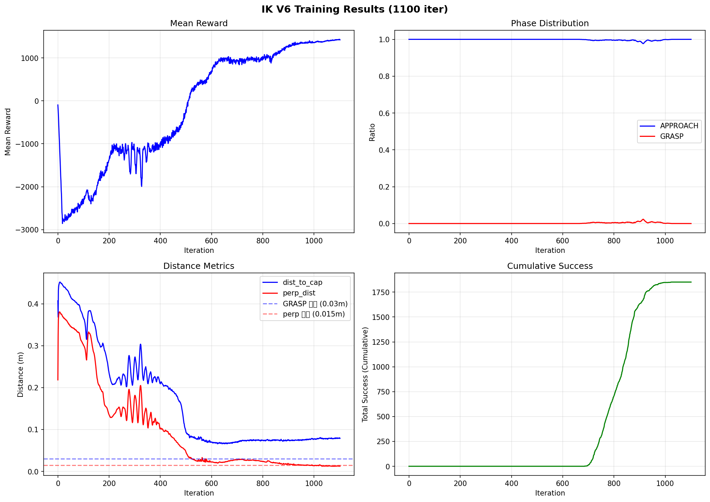

| 지표 | 초기값 | 최종값 (1100 iter) | 변화 |
|------|--------|-------------------|------|
| Mean Reward | -96 | **1,420** | +1,516 |
| perp_dist | 0.22m | **0.012m** | -95% ✅ |
| dist_to_cap | 0.41m | 0.079m | -81% |
| grasp_ratio | 0% | 0% | ❌ 문제 |

**Play 테스트 결과**:
- 위치 접근: ✅ 거의 완벽
- Z축 자세 정렬: ✅ 자동 계산으로 완벽
- GRASP 전환: ❌ 경계에서 진동, 잘못된 위치에서 그립 시도

**문제점 발견**:
1. **GRASP 경계 진동**: `dist_to_cap=0.03m` 조건에서 들어갔다 나왔다 반복
2. **부정확한 위치에서 그립**: 조건이 너무 느슨해서 실제 잡을 수 없는 위치에서 GRASP 진입
3. **GRASP 보상 부족**: APPROACH 보상이 더 안정적 → RL이 APPROACH 선호

---

### V6.1 수정 (2024-12-23)

**문제 분석**:
- `APPROACH_TO_GRASP_DIST = 0.03m` (3cm)는 실제로 펜을 잡기 어려운 거리
- `APPROACH_TO_GRASP_PERP = 0.015m` (1.5cm)도 너무 느슨
- GRASP 보상이 APPROACH 대비 매력적이지 않음

**변경 1: GRASP 전환 조건 강화**:
```python
# 기존 (V6)
APPROACH_TO_GRASP_DIST = 0.03    # 3cm
APPROACH_TO_GRASP_PERP = 0.015   # 1.5cm

# 수정 (V6.1)
APPROACH_TO_GRASP_DIST = 0.015   # 1.5cm (절반으로)
APPROACH_TO_GRASP_PERP = 0.008   # 8mm (거의 절반)
```

**변경 2: GRASP 보상 강화**:
```python
# 기존 (V6)
rew_scale_grasp_close = 5.0
rew_scale_grasp_hold = 10.0
rew_scale_phase_transition = 50.0

# 수정 (V6.1)
rew_scale_grasp_close = 10.0       # 2배
rew_scale_grasp_hold = 20.0        # 2배
rew_scale_phase_transition = 100.0 # 2배
```

**변경 3: 관찰 차원 수정**:
```python
observation_space = 27  # 24 → 27 (실제 차원에 맞춤)
# 구성: joint_pos(6) + joint_vel(6) + grasp_pos_local(3) + cap_pos_local(3) +
#       rel_pos(3) + pen_z(3) + perp_dist(1) + dist_cap(1) + phase(1) = 27
```

**V6.1 기대 효과**:
1. **진동 감소**: 더 정확한 위치에서만 GRASP 전환
2. **실제 잡기 성공률 향상**: 1.5cm, 8mm면 물리적으로 잡을 수 있는 위치
3. **GRASP 유지 유도**: 강화된 보상으로 GRASP ratio 안정화

**학습 명령어**:
```bash
cd ~/IsaacLab
source ~/isaacsim_env/bin/activate
python pen_grasp_rl/scripts/train_v6.py --headless --num_envs 4096 --level 0
```

---

### V6.2 수정 (2024-12-23)

**V6.1 학습 문제점**:
1. **거리 수렴 느림**: dist_to_cap이 0.06m까지 줄어드는 데 오래 걸림
2. **Value Function 발산**: Fixed LR에서도 Value Loss 급등 발생
3. **보상 스파이크**: phase_transition(100), success(200)가 너무 커서 Value 예측 어려움

**원인 분석**:
```
평소 보상: -2 ~ +5 (선형 페널티 + 진행 보상)
전환 시:   +100 💥 (갑자기 큰 보상)
성공 시:   +200 💥

→ Value Function이 큰 보상 예측 어려움 → 발산
```

**V6.2 핵심 변경**:

**1. 지수 보상 추가 (APPROACH)**:
```python
# dist_to_cap: 선형 + 지수
rewards += -15.0 * dist_to_cap                    # 선형 페널티
rewards += 10.0 * torch.exp(-dist_to_cap * 15.0)  # 지수 보상 (신규!)

# perp_dist: 선형 + 지수
rewards += -8.0 * perp_dist                       # 선형 페널티
rewards += 5.0 * torch.exp(-perp_dist * 50.0)     # 지수 보상 (신규!)
```

**2. 보상 스파이크 축소**:
| 항목 | V6.1 | V6.2 | 변경 |
|------|------|------|------|
| phase_transition | 100 | **30** | -70% |
| success | 200 | **50** | -75% |
| grasp_close | 10 | **5** | -50% |
| grasp_hold | 20 | **10** | -50% |

**3. 거리 보상 계산 예시**:
| dist_to_cap | 선형 (-15×d) | 지수 (+10×exp) | 합계 |
|-------------|-------------|----------------|------|
| 0.20m | -3.0 | +0.5 | -2.5 |
| 0.10m | -1.5 | +2.2 | +0.7 |
| 0.05m | -0.75 | +4.7 | **+4.0** |
| 0.02m | -0.3 | +7.4 | **+7.1** |

**V6.2 기대 효과**:
1. **빠른 거리 수렴**: 지수 보상으로 가까워질수록 급격한 보상 증가
2. **Value Function 안정화**: 보상 스파이크 축소로 예측 용이
3. **균형 잡힌 학습**: 스텝별 보상과 이벤트 보상 간 격차 축소

**학습 명령어**:
```bash
cd ~/IsaacLab
source ~/isaacsim_env/bin/activate
python pen_grasp_rl/scripts/train_v6.py --headless --num_envs 4096 --level 0 --fixed_lr
```

**다음 단계**: V6.2 학습 후 거리 수렴 속도 및 안정성 확인


---

## IK V6 30,000 스텝 학습 결과 (2024-12-24)

### 학습 환경
- **환경**: E0509IKEnvV6 (3DoF 위치 제어 + 자동 자세 정렬)
- **레벨**: Level 0 (펜 수직)
- **스텝**: 30,000 iterations
- **환경 수**: 4096

### 학습 결과

**학습 그래프**:

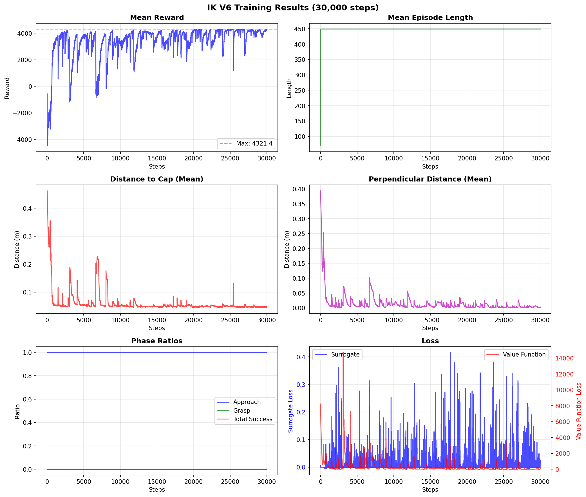

| 지표 | 시작 | 최종 | 최고 |
|------|------|------|------|
| Mean Reward | -563.78 | **4189.75** | 4321.41 |
| Episode Length | 69.44 | **449.00** | 449.00 |
| Distance to Cap | ~40cm | **4.68cm** | - |
| Perp Distance | ~13cm | **0.26cm** | - |
| Approach Ratio | 0% | **100%** | - |
| Grasp Ratio | 0% | **0%** | - |

### Play 테스트 결과

**테스트 GIF**:


**Play 로그 분석**:
```
Step 300: dist_to_cap=0.86cm, perp_dist=0.51cm, axis_dist=0.63cm
         캡 위에 있는 비율: 0% ← 캡을 지나침!
         dot(정렬)=-0.9624
         총 성공: 1348회
```

### 문제점 발견

1. **캡을 지나치는 문제**: 
   - 학습 시 dist_to_cap이 4.68cm에서 정체
   - Play 시 로봇이 펜 캡을 지나쳐서 그리퍼 안쪽으로 파고듦
   - axis_dist가 양수(캡 아래)가 되는 경우 발생

2. **자세 정렬과 위치 이동 간섭**:
   - IK가 위치와 자세를 동시에 처리
   - 자세 정렬하면서 grasp point 위치가 변함
   - 결과적으로 캡에 정확히 도달하지 못함

3. **GRASP 단계 미진입**:
   - 학습 로그에서 Grasp Ratio 0%
   - Play에서는 조건이 느슨해서 성공 (noise 없음)

---

## IK V7 환경 (2024-12-24) - APPROACH Only

### V7 핵심 변경사항

V6의 문제점을 해결하고 Sim2Real에 최적화:

| 항목 | V6 | V7 |
|------|----|----|
| 단계 | APPROACH → GRASP | **APPROACH만** |
| 성공 조건 | Good Grasp + 30스텝 | **위치 + 자세 + 캡 위 + 30스텝** |
| 그리퍼 | GRASP에서 닫기 | **항상 열림** |
| 목적 | 시뮬레이션 완결 | **Sim2Real Ready** |

### V7 성공 조건

```python
SUCCESS_DIST_TO_CAP = 0.03       # 캡까지 거리 < 3cm
SUCCESS_PERP_DIST = 0.01         # 펜 축에서 거리 < 1cm
SUCCESS_DOT_THRESHOLD = -0.95    # 자세 정렬 (dot < -0.95)
on_correct_side = True           # 캡 위에 있음 (지나치지 않음!)
SUCCESS_HOLD_STEPS = 30          # 30 스텝 유지
```

### V7 보상 구조

```python
# APPROACH (유일한 단계)
rewards += -15.0 * dist_to_cap                      # 거리 페널티
rewards += 10.0 * torch.exp(-dist_to_cap * 15.0)    # 거리 지수 보상
rewards += -8.0 * perp_dist                         # 펜축 페널티
rewards += 5.0 * torch.exp(-perp_dist * 50.0)       # 펜축 지수 보상
rewards += rew_scale_alignment * alignment_reward    # 자세 정렬 보상
rewards += above_cap_bonus                          # 캡 위 보너스
rewards[passed_cap] -= 1.0                          # 캡 지나침 페널티!

# 성공
rewards[success] += 100.0
```

### V7 설계 의도

1. **Sim2Real Gap 회피**: 
   - GRASP은 시뮬레이션과 현실이 많이 다름
   - 실제 로봇에서는 OSC/힘제어로 별도 처리

2. **캡 위 유지 강제**:
   - `on_correct_side` 조건 추가
   - 캡을 지나치면 성공 불가 + 페널티

3. **안정적인 접근 학습**:
   - GRASP 없이 위치+자세만 학습
   - 더 명확한 목표

### 학습 명령어

```bash
cd ~/IsaacLab
source ~/isaacsim_env/bin/activate
python pen_grasp_rl/scripts/train_ik_v7.py --headless --num_envs 4096 --level 0 --max_iterations 30000
```

---

## IK V7 5000 iter 학습 결과 (2024-12-24)

### 학습 설정
- **Level**: 0 (펜 수직)
- **환경 수**: 4096
- **LR**: Adaptive (3e-4)
- **Iterations**: 5000

### 결과 요약

| 메트릭 | 초기 | 최종 | 목표 | 상태 |
|--------|------|------|------|------|
| Mean Reward | -165.96 | **1177.13** | - | ✅ 우상향 |
| Episode Length | 21.67 | **449.00** | - | ✅ Max 도달 |
| dist_to_cap | 41.37cm | **19.96cm** | <3cm | ⚠️ 개선 중 |
| perp_dist | 22.10cm | **2.51cm** | <1cm | ✅ 거의 도달 |
| dot (자세) | -0.01 | **0.03** | <-0.95 | ❌ **문제!** |
| on_correct_side | 100% | 98.49% | - | ✅ 좋음 |
| success | 0 | **0** | - | 없음 |

### 문제 발견: V7이 V6보다 10배 느림!

**V6 vs V7 거리 도달 비교**:

| 거리 도달 | V6 (iteration) | V7 (5000 iter) |
|-----------|----------------|----------------|
| 20cm | **537** | **5000** (아직 도달 중) |
| 10cm | 664 | - |
| 5cm | 1738 | - |

**원인 분석**:
- V7에 `dot < -0.95` 성공 조건 추가됨
- 하지만 자세 정렬은 `_compute_auto_orientation()`이 자동 처리
- V6도 dot 조건 없이 잘 동작했음
- **불필요한 조건이 학습을 10배 느리게 만듦!**

---

## IK V7.1 수정 (2024-12-24) - dot 조건 제거

### 변경사항

**제거된 조건**:
```python
# V7 (문제)
SUCCESS_DOT_THRESHOLD = -0.95    # 제거됨!

success_condition = (
    dist < 3cm AND
    perp < 1cm AND
    dot < -0.95 AND      # ❌ 제거
    on_correct_side
)
```

**V7.1 성공 조건**:
```python
success_condition = (
    dist_to_cap < 3cm AND        # 캡까지 거리
    perp_dist < 1cm AND          # 펜 축 정렬
    on_correct_side              # 캡 위에 있음
)
# dot 조건 제거 - 자세는 자동 정렬되므로 불필요
```

### 이유
1. **자세는 자동 정렬**: `_compute_auto_orientation()`이 매 스텝 처리
2. **V6도 dot 조건 없었음**: V6 GRASP 조건에서 dot 제거됨
3. **학습 속도 10배 개선 예상**: V6 수준으로 빨라질 것

### 학습 명령어 (V7.1)

```bash
cd ~/IsaacLab
source ~/isaacsim_env/bin/activate
python pen_grasp_rl/scripts/train_v7.py --headless --num_envs 4096 --level 0
```

### 다음 단계

1. V7.1 학습 실행 및 속도 확인
2. V6 수준 (537 iter에 20cm)과 비교
3. 성공 조건 도달 확인

