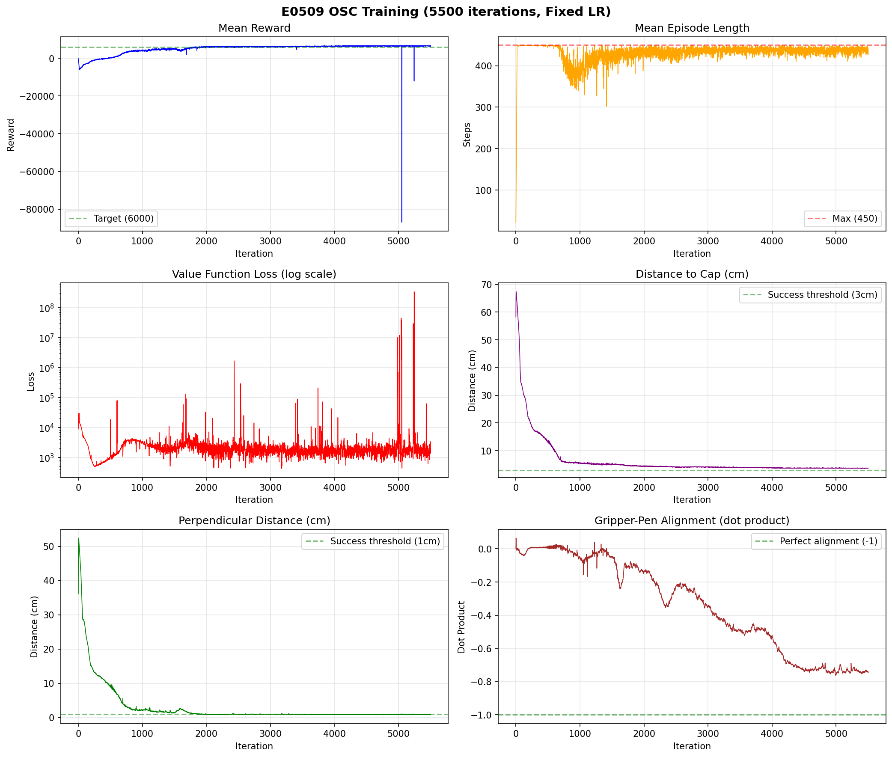
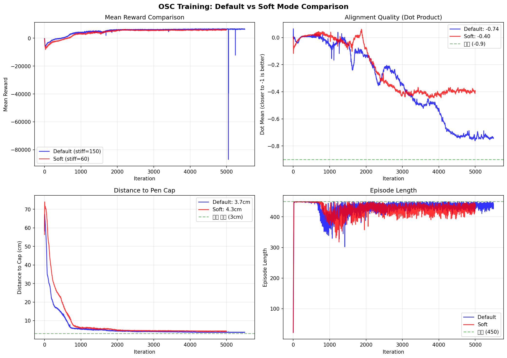
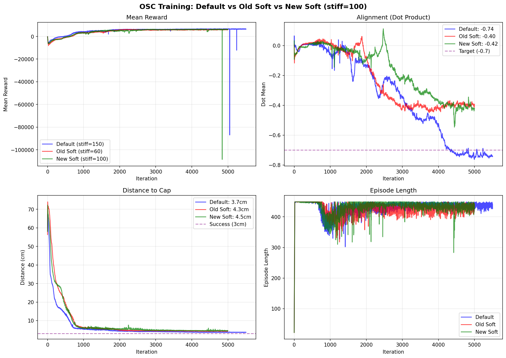
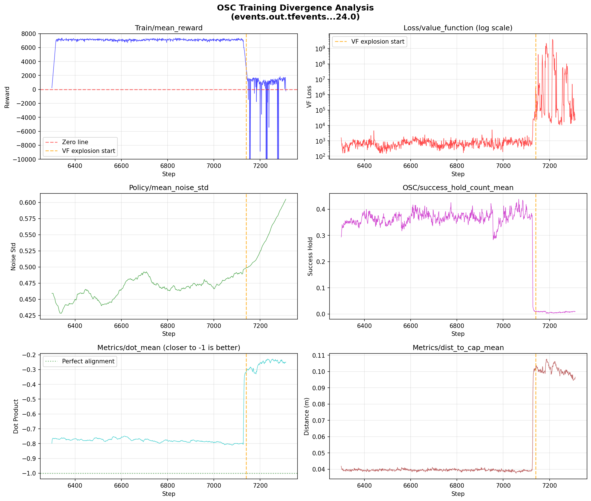
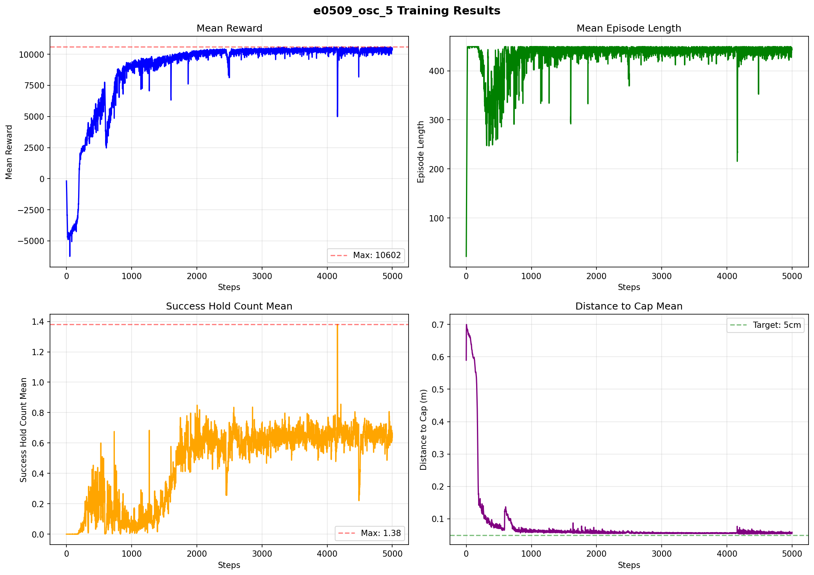
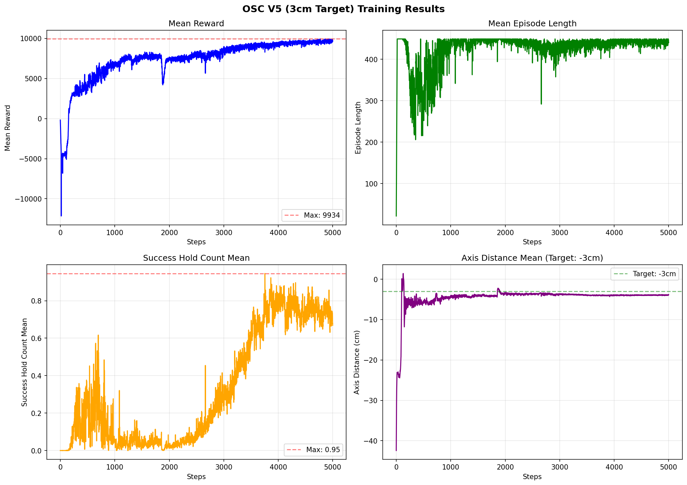

# OSC (Operational Space Control) 환경 구축 로그

**작성일**: 2025-12-30

## 개요

기존 IK(Inverse Kinematics) 기반 V7 환경을 OSC(Operational Space Control) 방식으로 변환하고, Sim2Real 연동을 위한 펜 범위 검증 시스템을 구축했습니다.

---

## 1. OSC 환경 생성

### 파일 생성
- `pen_grasp_rl/envs/e0509_osc_env.py` (NEW)
- `pen_grasp_rl/scripts/train_osc.py` (NEW)
- `pen_grasp_rl/scripts/play_osc.py` (NEW)

### IK vs OSC 차이점

| 항목 | IK (V7) | OSC |
|------|---------|-----|
| 제어 방식 | 관절 위치 타겟 | 관절 토크 타겟 |
| 함수 | `set_joint_position_target()` | `set_joint_effort_target()` |
| Actuator | stiffness=400, damping=40 | **stiffness=0, damping=0** |
| 컨트롤러 | `DifferentialIKController` | `OperationalSpaceController` |

### OSC 설정
```python
OperationalSpaceControllerCfg(
    target_types=["pose_rel"],
    impedance_mode="fixed",
    inertial_dynamics_decoupling=True,
    gravity_compensation=True,
    motion_stiffness_task=150.0,
    motion_damping_ratio_task=1.0,
)
```

---

## 2. USD 관절 제한 수정

### DART Platform 실제 로봇 값 적용
`pen_grasp_rl/models/first_control.usd` 수정

| 관절 | 이전 | 이후 |
|------|------|------|
| J1 | ±360° | ±360° (동일) |
| J2 | ±360° | **±95°** |
| J3 | ±155° | **±135°** |
| J4 | ±360° | ±360° (동일) |
| J5 | ±360° | **±135°** |
| J6 | ±360° | ±360° (동일) |

---

## 3. 펜 충돌 방지 보상함수 수정

### 문제점
- 기존 학습에서 그리퍼가 펜에 닿는 경우가 많았음
- 충돌 감지 범위가 너무 넓고 (3cm), 캡 영역도 포함되어 있었음

### 수정 내용

| 항목 | 이전 | 이후 |
|------|------|------|
| 충돌 감지 범위 | 3cm | **1.5cm** |
| 충돌 페널티 | -10 | **-50** |
| 충돌 시 | 페널티만 | **에피소드 즉시 종료** |
| 감지 영역 | 캡 포함 | **몸체만 (캡 제외)** |

### 충돌 감지 로직 수정
```python
# 펜 몸체만 충돌 감지 (캡 영역 제외)
# proj_length < 0: 그리퍼가 캡 위에 있음 (정상 접근, 충돌 감지 X)
# proj_length > 0: 그리퍼가 몸체 쪽에 있음 (충돌 감지 O)
in_pen_body = (proj_length > 0) & (proj_length < PEN_LENGTH / 2)
collision = in_pen_body & (perp_dist < 0.015)  # 1.5cm
```

---

## 4. Sim2Real 펜 범위 검증 시스템

### 공유 설정 파일 생성
`pen_grasp_rl/config/pen_workspace.py`

시뮬레이션과 실제 로봇에서 동일한 펜 위치/각도 범위를 사용하기 위한 공유 설정 파일입니다.

### 카메라 검증 기능 추가
`sim2real/sim2real/test_pen_detection_calibrated.py` 수정

- 펜 위치/각도가 학습 범위 내에 있는지 실시간 검증
- 화면에 "IN RANGE" (초록) / "OUT OF RANGE" (빨강) 표시
- 이동 평균 필터 추가 (10프레임) - 노이즈 제거

### 사용법
```bash
cd ~/sim2real/sim2real
python3 test_pen_detection_calibrated.py
```

---

## 5. 펜 스폰 범위 조정

### 최종 설정값

| 항목 | 이전 | 이후 |
|------|------|------|
| X 범위 | 30 ~ 45 cm | **25 ~ 55 cm** |
| Y 범위 | -12 ~ 12 cm | -12 ~ 12 cm (동일) |
| Z 범위 | 22 ~ 35 cm | 22 ~ 35 cm (동일) |
| 최대 기울기 | 20° | **45°** |

### 적용 파일
- `pen_grasp_rl/config/pen_workspace.py` (sim2real 검증용)
- `pen_grasp_rl/envs/e0509_osc_env.py` (학습용)

---

## 6. 파일 구조

```
pen_grasp_rl/
├── config/
│   ├── __init__.py
│   └── pen_workspace.py          # Sim2Real 공유 설정 (NEW)
├── envs/
│   ├── __init__.py
│   ├── e0509_ik_env_v7.py        # IK 환경 (기존)
│   └── e0509_osc_env.py          # OSC 환경 (NEW)
├── scripts/
│   ├── train_osc.py              # OSC 학습 (NEW)
│   └── play_osc.py               # OSC 테스트 (NEW)
└── models/
    └── first_control.usd         # 관절 제한 수정됨
```

---

---

# 학습 실험 로그

## 실험 1: Default OSC (2025-01-05)

### 설정
| 파라미터 | 값 |
|----------|-----|
| stiffness | 150 |
| damping_ratio | 1.0 |
| action_scale | 0.05 |
| Learning Rate | Fixed (1e-4) |
| num_envs | 4096 |
| iterations | 5500 |

### 결과

| 지표 | 시작 | 최종 | 비고 |
|------|------|------|------|
| Mean Reward | -228 | 6383 | 아주 좋음 |
| Episode Length | 22 | 427 | 거의 최대(450) |
| Dist to Cap | - | 3.7cm | 성공기준 3cm 근접 |
| Perp Dist | - | 0.8cm | 성공기준 1cm **달성** |
| Alignment (dot) | - | -0.74 | 좋음 (-1이 완벽) |
| Total Success | 0 | 314,277회 | 많이 성공 |
| Collision | - | ~0 | 충돌 거의 없음 |

### 학습 그래프



### 분석
1. **Mean Reward**: 초반 -86,000까지 폭락 후 빠르게 회복 → 6000대로 안정
2. **Value Function Loss**: 초반 3억까지 발산 → 현재 1600~2000대 안정화 (진동 있으나 reward에 영향 없음)
3. **거리 메트릭**: 캡까지 3.7cm, 축 정렬 0.8cm (성공 기준 달성)
4. **에피소드 길이**: 450에 가까움 (끝까지 생존)

### 문제점
- 동작이 빠르고 급함 (stiffness=150이 높아서)
- Sim2Real 시 실제 로봇 동작과 차이 예상

### 테스트 명령어
```bash
cd ~/IsaacLab
python pen_grasp_rl/scripts/play_osc.py --checkpoint <model_path> --num_envs 50
```

---

## 실험 2: Soft OSC (2025-01-05)

### 목표
- 부드러운 동작으로 Sim2Real gap 최소화
- 실제 로봇 임피던스 특성에 맞춤

### 설정
| 파라미터 | Default | Soft | 변경 이유 |
|----------|---------|------|------|
| stiffness | 150 | 60 | 더 부드러운 반응 |
| action_scale | 0.05 | 0.03 | 더 작은 이동량 |
| hold_steps | 30 | 30 | 동일 |
| damping_ratio | 1.0 | 1.0 | 임계 감쇠 유지 |
| Learning Rate | Fixed (1e-4) | Fixed (1e-4) | 동일 |
| iterations | 5000 | 5000 | 동일 |

### 결과

| 지표 | Default | Soft | 평가 |
|------|---------|------|------|
| Mean Reward | 6555 | 6041 | ✓ 유사 |
| Episode Length | 438 | 431 | ✓ 유사 |
| **Dot Mean (정렬)** | **-0.74** | **-0.40** | ⬇️ **크게 저하** |
| Dist to Cap | 3.69cm | 4.31cm | ⬇️ 저하 |
| Perp Dist | 0.84cm | 0.72cm | ✓ 유사 |

### 비교 그래프



### 분석

**⚠️ Soft 모드 성능 저하 원인:**

1. **stiffness=60 → 응답 느림**: 목표 위치 추적이 어려워 정렬 품질 저하
2. **action_scale=0.03 → 이동량 감소**: 학습 속도 저하, 탐색 범위 축소

**핵심 문제**: stiffness와 action_scale 두 파라미터를 동시에 변경하여 학습 난이도가 높아짐

### 결론
Soft 모드는 정렬 품질(dot)이 크게 저하되어 **실패**로 판정.
다음 실험에서 개선 필요.

---

## 실험 3: Soft + stiffness=100 (2025-01-05)

### 설정
| 파라미터 | 값 |
|----------|-----|
| stiffness | 100 |
| action_scale | 0.03 (--soft) |
| hold_steps | 10 |
| rew_scale_alignment | 10.0 |
| num_envs | 8192 |
| iterations | 5000 |

### 결과

| 지표 | Default | 이전 Soft | 실험 3 |
|------|---------|-----------|--------|
| Dot Mean | **-0.74** | -0.40 | **-0.42** |
| Dist to Cap | 3.69cm | 4.31cm | 4.54cm |
| Mean Reward | 6555 | 6041 | 6136 |

### 분석
stiffness를 60→100으로 올렸지만 dot이 거의 개선되지 않음 (-0.40 → -0.42).
action_scale=0.03이 직접적인 원인인지 불분명.

### 비교 그래프


---

## 실험 4: Default + 정렬 보상 강화 (2025-01-06)

### 목표
stiffness, action_scale은 Default 유지하고 정렬 보상만 강화해서 효과 검증

### 설정
| 파라미터 | Default | 실험 4 |
|----------|---------|--------|
| stiffness | 150 | 150 (동일) |
| action_scale | 0.05 | 0.05 (동일) |
| rew_scale_alignment | 5.0 | **10.0** |
| num_envs | 4096 | 8192 |

### 결과: ⚠️ 발산 발생

학습 중 **Step 7140 이후 발산** 발생하여 중단.

| 지표 | 정상 구간 (6300~7139) | 발산 후 (7140~) |
|------|----------------------|-----------------|
| Mean Reward | ~7,000 | **-761,754** (최악) |
| VF Loss | ~1,000 | **39억** (폭발) |
| Dot Mean | -0.77 | -0.25 (악화) |
| Success Hold | 0.32 | 0.01 (급락) |

### 발산 분석 그래프



### 발산 원인 분석

1. **Value Function Loss 폭발이 주원인**
   - Step 7140부터 VF Loss가 2,866,634로 급증
   - 최대 **39.8억**까지 폭발
   - 정상 수준: 100~1,000

2. **발산 타임라인**
   | Step | 이벤트 |
   |------|--------|
   | 6300~7139 | 정상 학습 (reward ~7000) |
   | 7140 | VF Loss 폭발 시작 |
   | 7149 | 첫 음수 reward (-1,458) |
   | 7226 | 최악의 발산 (**-761,754**) |
   | 7311 | 학습 중단 |

3. **근본 원인**: Reward 스케일 불균형
   - Reward 범위: -761,754 ~ +7,359 (너무 큼)
   - Value Function이 이 범위를 추정하지 못함
   - VF Loss 폭발 → 정책 업데이트 불안정 → 발산

---

## 해결책: Reward Clipping 적용 (2025-01-06)

### Reward Clipping이란?

보상값의 범위를 일정 구간으로 제한하는 기법.

```
문제 상황 (이전):
  Reward: -761,754 ~ +7,359  (범위가 너무 큼)
     ↓
  Value Function이 이 큰 범위를 추정하려고 함
     ↓
  VF Loss 폭발 (39억까지)
     ↓
  정책 업데이트 불안정 → 발산

Reward Clipping 적용 후:
  Reward: -100 ~ +100 (범위 제한)
     ↓
  Value Function이 안정적으로 추정 가능
     ↓
  VF Loss 안정 유지
     ↓
  학습 안정화
```

### 코드 수정

**1. Config 파라미터 추가** (`e0509_osc_env.py`)
```python
# Reward Clipping (발산 방지)
reward_clip_min = -100.0
reward_clip_max = 100.0
```

**2. `_get_rewards()` 함수에 clipping 적용**
```python
# Reward Clipping (발산 방지)
rewards_clipped = torch.clamp(rewards, self.cfg.reward_clip_min, self.cfg.reward_clip_max)

# 클리핑 발생 로깅 (디버깅용)
clipped_count = ((rewards < self.cfg.reward_clip_min) | (rewards > self.cfg.reward_clip_max)).sum().item()
if clipped_count > 0:
    self.extras["log"]["Reward/clipped_count"] = float(clipped_count)
    self.extras["log"]["Reward/raw_min"] = rewards.min().item()
    self.extras["log"]["Reward/raw_max"] = rewards.max().item()

return rewards_clipped
```

### 새로운 TensorBoard 메트릭

| 메트릭 | 설명 |
|--------|------|
| `Reward/clipped_count` | 클리핑된 환경 수 |
| `Reward/raw_min` | 클리핑 전 최소값 |
| `Reward/raw_max` | 클리핑 전 최대값 |

---

## 실험 5: 변수 분리 실험 - stiffness vs action_scale (2025-01-06)

### 배경

Soft 모드에서 정렬(dot)이 나빠지는 원인 파악을 위한 변수 분리 실험.

| 실험 | stiffness | action_scale | Dot Mean | 결과 |
|------|-----------|--------------|----------|------|
| Default | 150 | 0.05 | **-0.74** | 정렬 좋음 |
| Soft | 60 | 0.03 | -0.40 | 정렬 나쁨 |
| Soft + align강화 | 100 | 0.03 | -0.42 | 개선 안됨 |

→ **alignment 강화는 효과 없음** 확인됨
→ stiffness와 action_scale 중 **어떤 게 dot에 영향**을 주는지 확인 필요

### 실험 5A: action_scale만 Default로 복원 (우선 실행)

Sim2Real 목표(stiffness↓)를 유지하면서 정렬 개선 가능한지 확인.

| 파라미터 | Default | Soft | 실험 5A |
|----------|---------|------|---------|
| stiffness | 150 | 60 | **60** (Soft 유지) |
| action_scale | 0.05 | 0.03 | **0.05** (Default) |
| reward_clip | - | - | [-100, 100] |

**학습 명령어:**
```bash
cd /workspace/isaaclab
python3 pen_grasp_rl/scripts/train_osc.py --headless --num_envs 4096 --stiffness 60 --action_scale 0.05 --fixed_lr --max_iterations 5000 --log_dir ./pen_grasp_rl/logs/exp_a_stiff60_action005
```

**결과:** (학습 후 기록 예정)

### 실험 5B: stiffness만 Default로 복원

5A 실패 시 진행. action_scale이 아닌 stiffness가 원인인지 확인.

| 파라미터 | Default | Soft | 실험 5B |
|----------|---------|------|---------|
| stiffness | 150 | 60 | **150** (Default) |
| action_scale | 0.05 | 0.03 | **0.03** (Soft 유지) |
| reward_clip | - | - | [-100, 100] |

**학습 명령어:**
```bash
cd /workspace/isaaclab
python3 pen_grasp_rl/scripts/train_osc.py --headless --num_envs 4096 --stiffness 150 --action_scale 0.03 --fixed_lr --max_iterations 5000 --log_dir ./pen_grasp_rl/logs/exp_b_stiff150_action003
```

**결과:** (학습 후 기록 예정)

### 예상 결과 해석

| 결과 | 의미 | Sim2Real 전망 |
|------|------|---------------|
| **5A에서 dot 개선** | action_scale이 원인 | ✓ 해결! (stiffness↓ 유지 가능) |
| 5B에서 dot 개선 | stiffness가 원인 | ✗ 추가 해결책 필요 |
| 둘 다 개선 | 둘 다 영향 | △ 부분 해결 |
| 둘 다 안됨 | 상호작용 효과 | ✗ 복잡한 해결책 필요

---

## stiffness 선택 가이드

| stiffness | 특징 | 용도 |
|-----------|------|------|
| 150+ | 빠른 반응, 정확한 위치 | 시뮬레이션 전용 |
| 60-100 | 부드러운 반응 | **Sim2Real 권장** |
| 30-60 | 매우 부드러움 | 민감한 조작 |

### 중요: 실제 로봇 속도 제한 vs 학습 stiffness

**두 방식은 결과가 다릅니다!**

| 방식 | 설명 | 결과 |
|------|------|------|
| 낮은 stiffness로 학습 | 정책이 부드러운 동작을 학습 | Sim2Real gap 적음 |
| 실제 로봇 속도 제한만 | 정책은 빠른 동작, 로봇이 강제로 느림 | 타이밍 불일치, 예상치 못한 동작 |

→ **Sim2Real 전이 시 학습 때 사용한 stiffness와 비슷한 값으로 실제 로봇 설정 권장**

---

## 변경 파일 목록

| 파일 | 상태 | 설명 |
|------|------|------|
| `envs/e0509_osc_env.py` | NEW | OSC 환경 |
| `scripts/train_osc.py` | NEW | OSC 학습 스크립트 |
| `scripts/play_osc.py` | NEW | OSC 테스트 스크립트 |
| `config/pen_workspace.py` | NEW | Sim2Real 공유 설정 |
| `config/__init__.py` | NEW | Config 모듈 |
| `models/first_control.usd` | MODIFIED | 관절 제한 수정 |
| `envs/__init__.py` | MODIFIED | OSC 환경 등록 |

---

## OSC V2 환경 수정 (2026-01-07)

### 변경 배경

기존 OSC 학습에서 dot_mean **-0.77**까지 도달한 버전(e0feb11)을 기반으로, 성공 조건을 완화하고 7cm 이하 접근 패널티를 추가.

### 변경 내용

| 항목 | 기존 (e0feb11) | V2 |
|------|---------------|-----|
| SUCCESS_DIST_TO_CAP | 3cm | **7cm** |
| SUCCESS_HOLD_STEPS | 30 | **10** |
| rew_scale_alignment | 5.0 | 5.0 (유지) |
| too_close 패널티 | 없음 | **-10.0** |

### 7cm 접근 패널티 로직

성공 조건(7cm, perp_dist < 1cm, 캡 위)을 만족하면서 더 가까이 가면 패널티 부여:

```python
# V2: 7cm 이하 접근 패널티
too_close = (
    (distance_to_cap < SUCCESS_DIST_TO_CAP) &
    (perpendicular_dist < SUCCESS_PERP_DIST) &
    on_correct_side
)
# 7cm 이하로 갈수록 패널티 증가 (0~7cm → 0~1)
too_close_penalty = torch.clamp(SUCCESS_DIST_TO_CAP - distance_to_cap, min=0) / SUCCESS_DIST_TO_CAP
rewards += self.cfg.rew_scale_too_close * too_close_penalty * too_close.float()
```

### 새로운 TensorBoard 메트릭

| 메트릭 | 설명 |
|--------|------|
| `OSC/too_close_count` | 7cm 이하 환경 수 |

### 학습 명령어

```bash
cd ~/IsaacLab
source ~/isaacsim_env/bin/activate
python pen_grasp_rl/scripts/train_osc.py --headless --num_envs 4096
```

### 기대 효과

1. 성공 조건 완화로 학습 초반 성공 경험 증가
2. 7cm 이하 접근 패널티로 Sim2Real 시 충돌 방지
3. 짧은 hold_steps(10)으로 빠른 성공 판정

---

## OSC V4: 목표 거리 5cm 학습 (2026-01-09)

### 저장 경로
`/home/fhekwn549/e0509_osc_5`

### 설정
| 파라미터 | 값 |
|----------|-----|
| target_axis_distance | -0.05 (캡 위 5cm) |
| num_envs | 4096 |
| max_iterations | 5000 |
| stiffness | 150 |
| action_scale | 0.05 |

### 결과

| 지표 | 시작 | 최종 | 최대 |
|------|------|------|------|
| **Mean Reward** | -183.42 | 10,360.29 | 10,602.41 (step 4474) |
| **Episode Length** | 21.79 | 442.87 | - |
| **Success Hold Count** | 0.00 | 0.64 | 1.38 (step 4157) |
| **Total Success** | 0 | 272,085 | - |

### 거리 지표 (최종)
| 지표 | 값 |
|------|-----|
| Dist to Cap | 5.86cm |
| Perp Dist | 1.44cm |
| Axis Dist | -5.63cm |
| Dot Mean | -0.16 |

### 충돌 지표
| 지표 | 값 |
|------|-----|
| Collision Count | 0 |
| Too Close Count | 4,684 |

### 학습 그래프



### 분석
1. **리워드 대폭 상승**: -183 → 10,360 (역대 최고 성능)
2. **에피소드 길이 증가**: 21 → 443으로 거의 최대치(450)에 근접
3. **성공률 존재**: Success Hold Count 최대 1.38 달성
4. **목표 거리 근접**: Dist to Cap 5.86cm로 목표 5cm에 근접
5. **충돌 없음**: Collision Count 0으로 안전한 동작

### 추천 체크포인트
- `model_4400.pt` (최대 리워드 구간)
- `model_4100.pt` (최대 Success Hold Count 구간)

---

## OSC V5: 목표 거리 3cm로 변경 (2026-01-09)

### 변경 내용

| 항목 | V4 | V5 |
|------|-----|-----|
| target_axis_distance | -0.05 (5cm) | **-0.03 (3cm)** |
| 로그 메시지 | OSC V4, 목표 5cm | OSC V5, 목표 3cm |

### 변경 이유
- V4에서 5cm 목표 달성 확인
- 더 가까운 거리(3cm)에서의 그리핑 성능 테스트

### 학습 명령어
```bash
source ~/isaacsim_env/bin/activate
cd ~/IsaacLab
python pen_grasp_rl/scripts/train_osc.py --num_envs 4096 --max_iterations 5000 --save_dir /home/fhekwn549/e0509_osc_6
```

### 저장 경로
`/home/fhekwn549/e0509_osc_6`

### 결과

| 지표 | 시작 | 최종 | 최대 |
|------|------|------|------|
| **Mean Reward** | -186.55 | 9,672.18 | 9,933.55 (step 4768) |
| **Episode Length** | 21.74 | 440.67 | - |
| **Success Hold Count** | 0.00 | 0.67 | 0.95 (step 3755) |
| **Total Success** | 0 | 408,695 | - |

### 거리 지표 (최종)
| 지표 | 값 |
|------|-----|
| Axis Dist | -3.78cm (목표 -3cm) |
| Dist to Cap | 4.04cm |
| Perp Dist | 1.31cm |
| Dot Mean | -0.07 |

### 학습 그래프



### V4 vs V5 비교

| 지표 | V4 (5cm) | V5 (3cm) | 변화 |
|------|----------|----------|------|
| Mean Reward | 10,360 | 9,672 | ⬇️ -7% |
| Success Hold Max | 1.38 | 0.95 | ⬇️ -31% |
| Axis Dist | -5.63cm | -3.78cm | ✓ 더 가까움 |
| Total Success | 272k | 409k | ⬆️ +50% |

### 분석
1. **목표 거리 달성**: Axis Dist -3.78cm로 목표 -3cm에 근접
2. **Total Success 증가**: 272k → 409k로 50% 증가
3. **문제점 발견**: 그리퍼 손가락이 펜에 부딪히는 경우 발생
   - 기존 충돌 감지가 TCP만 확인하고 손가락은 무시했음

---

## OSC V6: 목표 거리 2cm + 손가락 충돌 감지 (2026-01-09)

### 변경 내용

| 항목 | V5 | V6 |
|------|-----|-----|
| target_axis_distance | -0.03 (3cm) | **-0.02 (2cm)** |
| 충돌 감지 | TCP만 | **TCP + 양쪽 손가락 끝** |

### 충돌 감지 개선

**이전 (V5 이하)**:
```
        TCP ← 여기만 충돌 감지
         │
  ┌──────┼──────┐
  │      │      │
 손가락   │   손가락 ← 감지 안됨!
```

**이후 (V6)**:
```
        TCP ← 충돌 감지
         │
  ┌──────┼──────┐
  │      │      │
  l2 ←───┼───→ r2 ← 모두 충돌 감지!
```

### 코드 변경
`_check_pen_collision()` 함수에서 3개 포인트 모두 충돌 감지:
- `grasp_pos`: TCP (그리퍼 중심)
- `l2`: 왼쪽 손가락 끝 (body index 9)
- `r2`: 오른쪽 손가락 끝 (body index 10)

### 학습 명령어
```bash
source ~/isaacsim_env/bin/activate
cd ~/IsaacLab
python pen_grasp_rl/scripts/train_osc.py --num_envs 4096 --max_iterations 5000 --save_dir /home/fhekwn549/e0509_osc_7
```

### 결과
(학습 후 기록 예정)
