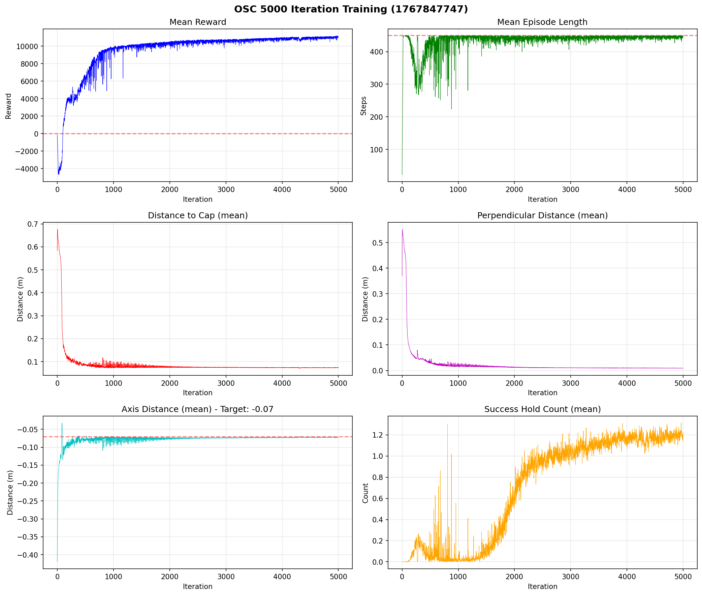

# OSC (Operational Space Control) Training Log

## Overview
- 로봇: Doosan E0509 + RH-P12-RN-A 그리퍼
- 제어 방식: OSC (토크 제어, Sim2Real 친화적)
- 목표: 펜 캡 위 목표 거리에서 정지

---

## V3 - 2026-01-08 (5000 iter)

### 설정
- `target_axis_distance`: -0.07 (캡 위 7cm)
- `action_scale`: 0.05
- `osc_motion_stiffness`: 150
- 환경 수: 4096
- 로그 경로: `/home/fhekwn549/e0509_osc`

### 결과
| 지표 | 시작 (iter 0) | 최종 (iter 4999) |
|------|---------------|------------------|
| Mean Reward | -166.8 | **10,990.3** |
| Episode Length | 22.2 | **443.7** |
| dist_to_cap | 0.584m | **0.074m** |
| perp_dist | 0.369m | **0.009m** |
| axis_dist | -0.42m | **-0.073m** |
| success_hold_count | 0 | **1.17** |

### 학습 그래프


### 문제점
1. **동작 끝 진동**: 목표 근처에서 action이 계속 변동하면서 진동 발생
2. **펜-그리퍼 거리**: 7cm는 잡기에 너무 멀음

---

## V4 - 2026-01-09 (예정)

### 변경 사항
| 항목 | V3 | V4 |
|------|-----|-----|
| `target_axis_distance` | -0.07 (7cm) | **-0.05 (5cm)** |
| `rew_scale_action_smooth` | 없음 | **-0.5** |

### 핵심 수정
1. **목표 거리 축소**: 7cm → 5cm (그리퍼가 더 가까이 접근)
2. **진동 억제**: Action smoothness penalty 추가
   - 이전 action과 현재 action의 차이에 패널티 부여
   - 급격한 action 변화 억제 → 부드러운 동작

### 학습 명령어
```bash
source ~/isaacsim_env/bin/activate
cd ~/IsaacLab

python pen_grasp_rl/scripts/train_osc.py \
    --headless \
    --num_envs 4096 \
    --max_iterations 5000 \
    --log_dir /home/fhekwn549/e0509_osc_v4
```

### 결과
(학습 후 업데이트 예정)

---

## 참고: OSC vs IK

| 항목 | IK (Inverse Kinematics) | OSC (Operational Space Control) |
|------|-------------------------|--------------------------------|
| 제어 방식 | 관절 위치 타겟 | 관절 토크 타겟 |
| 함수 | `set_joint_position_target()` | `set_joint_effort_target()` |
| 장점 | 구현 간단 | Sim2Real gap 감소, 접촉 시 부드러운 반응 |
| 단점 | Sim2Real gap 큼 | 구현 복잡, 튜닝 필요 |
